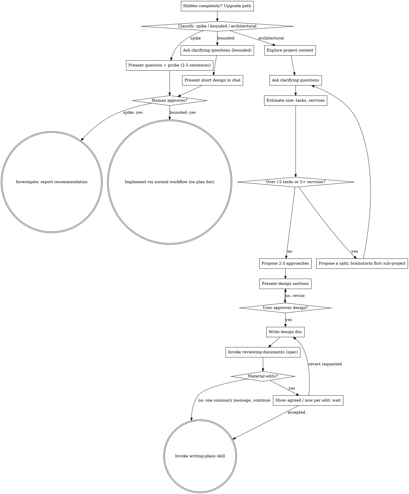

# Workflow Revision Part 1: Document Review Loop and Transitions — Implementation Plan

> **For agentic workers:** Use superpowers:executing-plans to implement this plan task-by-task, or superpowers:subagent-driven-development when tasks need a per-task review gate. TDD applies in both. Steps use checkbox (`- [ ]`) syntax for tracking.

**Goal:** Replace inline self-review of specs and plans with a bounded fresh-subagent review loop, and let brainstorming continue to writing-plans without a stop when the review changed nothing the human agreed to.

**Architecture:** One new skill, `reviewing-documents`, owns the loop (full review, scoped re-reviews, three-round cap, review notes) and is invoked by brainstorming and writing-plans. Edits to the two callers are confined to closed blocks: the architectural checklist and graph in brainstorming, the review and header blocks in writing-plans. The existing reviewer prompt templates stay where they are and gain an explicit model line; the plan template gains a tree-verification check. A structural test guards references and removed text.

**Tech Stack:** Markdown skill files, bash test script (repository convention in `tests/claude-code/`), graphviz `dot` for the brainstorming graph, git.

**Spec:** `docs/superpowers/specs/2026-09-13-workflow-revision-design.md` — sections 5, 6, 7.1–7.3, 10, 13.1. Part 2 (sections 7.4, 8, 9, 11) is a separate plan.

> **Executed 2026-09-13.** The whole-branch review afterwards changed the skill text this plan quotes in Tasks 2, 3, 4 and 6 (clean loop exit, advice kept out of Review notes, revert edge routed to writing-plans, bare `[MODEL]` token, extra test assertions). The repository is authoritative; do not re-execute this plan's literal blocks over it.

## Global Constraints

- Repository: the fork checkout, branch `workflow-revision`. All paths below are relative to its root.
- Git identity is repo-local and already set; every commit must show `30889176+ViktorGozhiy@users.noreply.github.com` as author and committer. Check with `git log --format='%ae %ce' -1` after each commit.
- No personal data in file content: no surnames, no employer domains, no work email addresses.
- Reviewer model default, verbatim: "one tier below the model this session runs on, with `opus` as the floor".
- Round cap: 3 (one full review, two scoped re-reviews).
- Task-count threshold: 12.
- New text uses positive wording with the reason in the same sentence. Do not write `MUST`, `CRITICAL`, or `Do NOT rely on` in new text.
- Files not named in this plan are not edited. In particular `skills/writing-plans/SKILL.md`'s "Execution Handoff" section stays as it is in v6.3.0 (Part 2 replaces it).
- Skill frontmatter: `name` and `description` only; `description` starts with "Use when" and is written in third person.

---

### Task 1: Structural test (red)

**Files:**
- Create: `tests/claude-code/test-workflow-revision.sh`
- Modify: `tests/claude-code/run-skill-tests.sh` (the `tests=(` array, currently lines 76–80)

**Interfaces:**
- Consumes: nothing.
- Produces: a test that later tasks turn green; it asserts the paths and text that Tasks 2–7 create or remove.

- [ ] **Step 1: Write the test script**

```bash
#!/usr/bin/env bash
# Structural checks for the workflow revision: the reviewing-documents skill
# exists and is referenced, its cross-directory references resolve, the
# brainstorming graph parses, and the inline self-review blocks are gone.

set -euo pipefail

SCRIPT_DIR="$(cd "$(dirname "$0")" && pwd)"
REPO_ROOT="$(cd "$SCRIPT_DIR/../.." && pwd)"
SKILLS="$REPO_ROOT/skills"

REVIEWING_SKILL="$SKILLS/reviewing-documents/SKILL.md"
RE_REVIEW_PROMPT="$SKILLS/reviewing-documents/re-review-prompt.md"
BRAINSTORMING="$SKILLS/brainstorming/SKILL.md"
WRITING_PLANS="$SKILLS/writing-plans/SKILL.md"
SPEC_PROMPT="$SKILLS/brainstorming/spec-document-reviewer-prompt.md"
PLAN_PROMPT="$SKILLS/writing-plans/plan-document-reviewer-prompt.md"

failures=0

pass() { echo "  [PASS] $1"; }
fail() { echo "  [FAIL] $1"; shift; for line in "$@"; do echo "    $line"; done; failures=$((failures + 1)); }

assert_file() {
    if [ -f "$1" ]; then pass "$2"; else fail "$2" "missing file: $1"; fi
}

assert_contains() {
    local file="$1" pattern="$2" label="$3"
    if [ -f "$file" ] && grep -Fq -- "$pattern" "$file"; then pass "$label"
    else fail "$label" "expected to find: $pattern" "in file: $file"; fi
}

assert_not_contains() {
    local file="$1" pattern="$2" label="$3"
    if [ -f "$file" ] && grep -Fq -- "$pattern" "$file"; then
        fail "$label" "did not expect to find: $pattern" "in file: $file"
    else pass "$label"; fi
}

# Every `superpowers:<name>` reference in a file names an existing skill directory.
assert_skill_refs_resolve() {
    local file="$1" label="$2" ok=1
    [ -f "$file" ] || { fail "$label" "missing file: $file"; return; }
    while IFS= read -r name; do
        if [ ! -d "$SKILLS/$name" ]; then ok=0; echo "    unresolved skill reference: superpowers:$name"; fi
    done < <(grep -o 'superpowers:[a-z-]*' "$file" | sed 's/superpowers://' | sort -u)
    if [ "$ok" -eq 1 ]; then pass "$label"; else fail "$label" "in file: $file"; fi
}

# Every relative `.md` path in backticks resolves from the file's directory.
assert_md_refs_resolve() {
    local file="$1" label="$2" ok=1 dir
    [ -f "$file" ] || { fail "$label" "missing file: $file"; return; }
    dir="$(dirname "$file")"
    while IFS= read -r ref; do
        if [ ! -f "$dir/$ref" ]; then ok=0; echo "    unresolved path: $ref"; fi
    done < <(grep -o '`[./a-z-]*\.md`' "$file" | tr -d '`' | sort -u)
    if [ "$ok" -eq 1 ]; then pass "$label"; else fail "$label" "in file: $file"; fi
}

echo "=== Workflow Revision Structural Test ==="
echo ""

echo "-- reviewing-documents skill"
assert_file "$REVIEWING_SKILL" "reviewing-documents/SKILL.md exists"
assert_file "$RE_REVIEW_PROMPT" "reviewing-documents/re-review-prompt.md exists"
assert_contains "$REVIEWING_SKILL" "name: reviewing-documents" "frontmatter name"
assert_contains "$REVIEWING_SKILL" "description: Use when" "description starts with Use when"
assert_md_refs_resolve "$REVIEWING_SKILL" "reviewing-documents references resolve"
assert_contains "$RE_REVIEW_PROMPT" "[DIFF_FILE]" "re-review prompt takes a diff file"
assert_contains "$RE_REVIEW_PROMPT" "NOT ADDRESSED" "re-review prompt returns per-finding verdicts"

echo ""
echo "-- reviewer prompt templates"
assert_contains "$SPEC_PROMPT" "model:" "spec reviewer dispatch names a model"
assert_contains "$PLAN_PROMPT" "model:" "plan reviewer dispatch names a model"
assert_contains "$PLAN_PROMPT" "Tree verification" "plan reviewer checks the plan against the tree"

echo ""
echo "-- brainstorming"
assert_skill_refs_resolve "$BRAINSTORMING" "brainstorming skill references resolve"
assert_contains "$BRAINSTORMING" "superpowers:reviewing-documents" "brainstorming invokes reviewing-documents"
assert_not_contains "$BRAINSTORMING" "Spec self-review" "brainstorming checklist has no inline self-review step"
assert_not_contains "$BRAINSTORMING" "Spec Self-Review" "brainstorming prose has no inline self-review block"
assert_contains "$BRAINSTORMING" "12 tasks" "brainstorming states the task-count threshold"
# render-graphs.js exits 0 even when dot rejects a graph, so feed the block to dot directly.
if command -v dot >/dev/null 2>&1; then
    graph_file="$(mktemp)"
    awk '/^```dot$/{on=1; next} /^```$/{on=0} on' "$BRAINSTORMING" > "$graph_file"
    if [ -s "$graph_file" ] && dot -Tsvg -o /dev/null "$graph_file" 2>/dev/null; then
        pass "brainstorming graph parses"
    else
        fail "brainstorming graph parses" "dot rejected the graph extracted from $BRAINSTORMING"
    fi
    rm -f "$graph_file"
else
    echo "  [SKIP] brainstorming graph parses (graphviz not installed)"
fi

echo ""
echo "-- writing-plans"
assert_skill_refs_resolve "$WRITING_PLANS" "writing-plans skill references resolve"
assert_contains "$WRITING_PLANS" "superpowers:reviewing-documents" "writing-plans invokes reviewing-documents"
assert_not_contains "$WRITING_PLANS" "## Self-Review" "writing-plans has no inline self-review section"
assert_not_contains "$WRITING_PLANS" "subagent-driven-development (recommended)" "plan header no longer recommends SDD"
assert_contains "$WRITING_PLANS" "12 tasks" "writing-plans states the task-count threshold"

echo ""
if [ "$failures" -gt 0 ]; then
    echo "STATUS: FAILED ($failures failures)"
    exit 1
fi
echo "STATUS: PASSED"
```

- [ ] **Step 2: Register the test in the runner**

In `tests/claude-code/run-skill-tests.sh`, change the fast test list from:

```bash
tests=(
    "test-worktree-path-policy.sh"
    "test-sdd-workspace.sh"
    "test-subagent-driven-development.sh"
)
```

to:

```bash
tests=(
    "test-worktree-path-policy.sh"
    "test-sdd-workspace.sh"
    "test-workflow-revision.sh"
    "test-subagent-driven-development.sh"
)
```

- [ ] **Step 3: Run the test to see it fail**

Run: `chmod +x tests/claude-code/test-workflow-revision.sh && bash tests/claude-code/test-workflow-revision.sh`
Expected: `STATUS: FAILED` with these failing lines (others pass because the text they assert against is absent or present in v6.3.0 as expected):
- `[FAIL] reviewing-documents/SKILL.md exists`
- `[FAIL] reviewing-documents/re-review-prompt.md exists`
- `[FAIL] frontmatter name`, `[FAIL] description starts with Use when`, `[FAIL] reviewing-documents references resolve`
- `[FAIL] re-review prompt takes a diff file`, `[FAIL] re-review prompt returns per-finding verdicts`
- `[FAIL] spec reviewer dispatch names a model`, `[FAIL] plan reviewer dispatch names a model`, `[FAIL] plan reviewer checks the plan against the tree`
- `[FAIL] brainstorming invokes reviewing-documents`, `[FAIL] brainstorming checklist has no inline self-review step`, `[FAIL] brainstorming prose has no inline self-review block`, `[FAIL] brainstorming states the task-count threshold`
- `[FAIL] writing-plans invokes reviewing-documents`, `[FAIL] writing-plans has no inline self-review section`, `[FAIL] plan header no longer recommends SDD`, `[FAIL] writing-plans states the task-count threshold`
- `[PASS] brainstorming graph parses` (the v6.3.0 graph is valid)

- [ ] **Step 4: Commit**

```bash
git add tests/claude-code/test-workflow-revision.sh tests/claude-code/run-skill-tests.sh
git commit -m "test: add structural checks for the document review loop"
git log --format='%ae %ce' -1
```

---

### Task 2: Skill `reviewing-documents`

**Files:**
- Create: `skills/reviewing-documents/SKILL.md`

**Interfaces:**
- Consumes: `../brainstorming/spec-document-reviewer-prompt.md`, `../writing-plans/plan-document-reviewer-prompt.md` (Task 4 adds their model lines), `re-review-prompt.md` (Task 3).
- Produces: the skill name `superpowers:reviewing-documents` with inputs `document`, `kind`, `spec`, and the prose output contract (status, rounds, edits with class, review notes) that Tasks 5–7 rely on.

- [ ] **Step 1: Write the skill file**

````markdown
---
name: reviewing-documents
description: Use when a design spec or an implementation plan has just been written and committed and needs an independent read before the workflow moves to the next stage
---

# Reviewing Documents

Review a spec or a plan with reviewer subagents that read it without the history of writing it, until it is approved or the round cap is reached, then report what changed.

**Announce at start:** "I'm using the reviewing-documents skill to review the <spec|plan>."

**Called by:** brainstorming (spec, architectural path) and writing-plans (plan). Your human partner does not invoke it directly.

## Why a fresh reader, and why only one full read

You wrote the document, so you read it the way you meant it. A reviewer subagent reads only what is on the page and therefore notices what you treat as obvious: the requirement that lives in your head, the two sections that quietly disagree, the plan step that assumes a function the repository does not have. One full read finds those.

Repeated full reads do not converge: every fresh reader also brings a fresh set of taste findings. So this skill runs one full review and then verifies fixes only.

## Inputs

- `document`: absolute path of the spec or plan. It is already committed.
- `kind`: `spec` or `plan`.
- `spec` (plans only): absolute path of the spec the plan implements.

## Model

Name the model on every dispatch. Default: one tier below the model this session runs on, with `opus` as the floor. In Claude Code that is `model: opus` for a session on Fable or on Opus, and still `opus` for a session on Sonnet, because reading a whole design or plan for defects is a judgment task. An unnamed model inherits this session's model, usually the most expensive one, and that cost is what this default avoids.

## Round 1: full review

Dispatch a fresh `general-purpose` subagent with the template for the kind:

- `spec`: `../brainstorming/spec-document-reviewer-prompt.md` with `[SPEC_FILE_PATH]` = `document`.
- `plan`: `../writing-plans/plan-document-reviewer-prompt.md` with `[PLAN_FILE_PATH]` = `document` and `[SPEC_FILE_PATH]` = `spec`.

Both templates return `Status: Approved | Issues Found`, a list of `Issues` (blocking), and `Recommendations` (advisory).

- `Approved`: go to Output with zero edits.
- `Issues Found`: fix every Issue in the document. Apply a Recommendation only when it clearly improves the document, and only in this revision: a Recommendation on its own never starts a round, because rounds exist for defects that would mislead the next stage. Record the commit the reviewer saw (`git rev-parse HEAD` before editing), then commit the revision: `docs: address <spec|plan> review round 1`.

## Rounds 2 and 3: scoped re-review

After each revision, dispatch a fresh subagent with `re-review-prompt.md`:

- `[FINDINGS]`: the Issues from the previous round, verbatim.
- `[DOCUMENT]`: `document`.
- `[DIFF_FILE]`: the output of `git diff <commit the previous round reviewed> HEAD -- <document>`, written to a file in your scratch directory. Pass the path, not the text: a pasted diff stays in your context for the rest of the session.

The re-reviewer verdicts each finding `ADDRESSED` or `NOT ADDRESSED` and lists `New breakage`: contradictions or placeholders that the revision itself introduced. It does not read untouched text for new findings.

Fix open findings and new breakage, commit (`docs: address <spec|plan> review round 2`), and re-review. Round 3 is the last.

## The cap

Three rounds: one full review and two scoped re-reviews. When findings are still open after round 3, rule on each one yourself:

- fix it now when the fix is small and clearly right;
- otherwise leave it and record why.

Write every ruling into the document under a final heading `## Review notes`, one bullet per finding: the finding, the ruling, the reason. Commit (`docs: record <spec|plan> review notes`). The section travels with the document to your human partner and to whoever executes the plan, so a finding you overruled is still visible to them.

## Output

Return to the calling skill, in prose:

- status: `Approved` or `Approved with N review notes`;
- rounds run;
- edits made, one line each, and for each edit whether it changed a decision, a requirement, scope, or only wording. The calling skill uses this classification to decide whether to stop for the human;
- review notes, if any.

## Common Rationalizations

| Excuse | Reality |
|--------|---------|
| "I'll re-read it myself, dispatching is overhead" | You read it the way you meant it. The reviewer reads what is on the page. |
| "That recommendation is good, one more round to be safe" | Recommendations apply once, in the current revision. Rounds are for blocking Issues. |
| "The re-reviewer should read the whole thing again" | A full read each round brings new taste findings each round; the loop never converges. |
| "Three rounds and still open, one more will settle it" | Past the cap the disagreement is structural. Rule, record it in Review notes, move on. |
| "The model doesn't matter for reading a document" | An unnamed model inherits this session's, the most expensive one. Name it. |
````

- [ ] **Step 2: Run the structural test**

Run: `bash tests/claude-code/test-workflow-revision.sh`
Expected: these lines now pass: `reviewing-documents/SKILL.md exists`, `frontmatter name`, `description starts with Use when`. Still failing under this heading: `reviewing-documents/re-review-prompt.md exists`, `reviewing-documents references resolve`, and the two `re-review prompt` checks, because `re-review-prompt.md` does not exist yet; everything under the other headings still fails as in Task 1.

- [ ] **Step 3: Commit**

```bash
git add skills/reviewing-documents/SKILL.md
git commit -m "feat: add reviewing-documents skill"
git log --format='%ae %ce' -1
```

---

### Task 3: Document re-review prompt

**Files:**
- Create: `skills/reviewing-documents/re-review-prompt.md`

**Interfaces:**
- Consumes: placeholders `[MODEL]`, `[FINDINGS]`, `[DOCUMENT]`, `[DIFF_FILE]` as named in Task 2.
- Produces: the output format (`ADDRESSED` / `NOT ADDRESSED`, `New breakage`, `Verdict`) that Task 2's loop reads.

- [ ] **Step 1: Write the template**

````markdown
# Document Re-Review Prompt Template

Use this template for rounds 2 and 3 of the reviewing-documents loop. The re-reviewer verifies that the previous round's findings were addressed and that the revision broke nothing. It is not a fresh review: the full review already happened in round 1.

**Purpose:** Verdict each finding from the previous round and inspect the revision diff for new breakage.

```
Subagent (general-purpose):
  description: "Re-review <spec|plan> revision, round <R>"
  model: [MODEL — one tier below this session's model, floor opus; see SKILL.md in this directory]
  prompt: |
    You are re-reviewing a revision of a design spec or an implementation plan.
    A previous reviewer raised the findings below; the author revised the
    document. Verdict each finding and inspect the revision diff. That is the
    whole job: a fresh full read would find a fresh set of taste findings and
    the loop would never converge, so stay on the findings and on the diff.

    **Document:** [DOCUMENT]
    **Revision diff (read this file first):** [DIFF_FILE]

    ## Findings under verification

    [FINDINGS]

    ## Scope

    Your scope is the findings list and the revision diff. Read the document
    around each finding to judge whether the specific defect no longer
    exists; "attempted" is not addressed. Read the diff for contradictions
    or placeholders the revision itself introduced. Text the revision did
    not touch is out of scope: do not report new findings from it.

    ## Output format

    Begin directly with the first verdict. No preamble.

    ## <Spec|Plan> Re-Review

    For each finding, in order, one line:
    `N. ADDRESSED — <where and how>` or `N. NOT ADDRESSED — <what is still missing>`

    **New breakage:** contradictions or placeholders introduced by the diff,
    each with the section it appears in — or `none`.

    **Verdict:** `All findings addressed` or `Open findings remain`
```

**Placeholders:**
- `[MODEL]` — reviewer model per `SKILL.md` in this directory; the floor is `opus`
- `[FINDINGS]` — the `Issues` from the previous round, copied verbatim, numbered
- `[DOCUMENT]` — absolute path of the spec or plan
- `[DIFF_FILE]` — path of the file holding `git diff <commit the previous round reviewed> HEAD -- <document>`

**Re-reviewer returns:** per-finding verdicts, new breakage, and a round verdict.
````

- [ ] **Step 2: Run the structural test**

Run: `bash tests/claude-code/test-workflow-revision.sh`
Expected: all lines under `-- reviewing-documents skill` pass, including `reviewing-documents references resolve`, `re-review prompt takes a diff file`, `re-review prompt returns per-finding verdicts`. The other headings still have failures.

- [ ] **Step 3: Commit**

```bash
git add skills/reviewing-documents/re-review-prompt.md
git commit -m "feat: add scoped re-review prompt for documents"
git log --format='%ae %ce' -1
```

---

### Task 4: Reviewer prompt templates name their model; plan reviewer checks the tree

**Files:**
- Modify: `skills/brainstorming/spec-document-reviewer-prompt.md` (dispatch block lines 10–12 and the closing "Reviewer returns" line)
- Modify: `skills/writing-plans/plan-document-reviewer-prompt.md` (dispatch block lines 10–12, the "What to Check" table, the Calibration paragraph, and the closing line)

**Interfaces:**
- Consumes: nothing new.
- Produces: `model:` line in both dispatch blocks; the `Tree verification` row that Task 2's round 1 relies on for plans.

- [ ] **Step 1: Add the model line to the spec reviewer template**

In `skills/brainstorming/spec-document-reviewer-prompt.md`, replace:

```
Subagent (general-purpose):
  description: "Review spec document"
  prompt: |
```

with:

```
Subagent (general-purpose):
  description: "Review spec document"
  model: [MODEL — one tier below this session's model, floor opus; see ../reviewing-documents/SKILL.md]
  prompt: |
```

and replace the final line

```
**Reviewer returns:** Status, Issues (if any), Recommendations
```

with:

```
**Placeholders:**
- `[MODEL]` — reviewer model per `../reviewing-documents/SKILL.md`; the floor is `opus`
- `[SPEC_FILE_PATH]` — absolute path of the spec

**Reviewer returns:** Status, Issues (if any), Recommendations
```

- [ ] **Step 2: Add the model line, the tree check, and the calibration sentence to the plan reviewer template**

In `skills/writing-plans/plan-document-reviewer-prompt.md`, replace:

```
Subagent (general-purpose):
  description: "Review plan document"
  prompt: |
```

with:

```
Subagent (general-purpose):
  description: "Review plan document"
  model: [MODEL — one tier below this session's model, floor opus; see ../reviewing-documents/SKILL.md]
  prompt: |
```

Replace the "What to Check" table:

```
    | Category | What to Look For |
    |----------|------------------|
    | Completeness | TODOs, placeholders, incomplete tasks, missing steps |
    | Spec Alignment | Plan covers spec requirements, no major scope creep |
    | Task Decomposition | Tasks have clear boundaries, steps are actionable |
    | Buildability | Could an engineer follow this plan without getting stuck? |
```

with:

```
    | Category | What to Look For |
    |----------|------------------|
    | Completeness | TODOs, placeholders, incomplete tasks, missing steps |
    | Spec Alignment | Plan covers spec requirements, no major scope creep |
    | Task Decomposition | Tasks have clear boundaries, steps are actionable |
    | Buildability | Could an engineer follow this plan without getting stuck? |
    | Tree verification | Open every file the plan modifies. Do the classes, functions, signatures, imports, and test names the plan refers to exist as the plan assumes? Do the plan's new symbols collide with existing ones? Report each mismatch with file and line. |
```

Replace the Calibration paragraph:

```
    Approve unless there are serious gaps — missing requirements from the spec,
    contradictory steps, placeholder content, or tasks so vague they can't be acted on.
```

with:

```
    Approve unless there are serious gaps — missing requirements from the spec,
    contradictory steps, placeholder content, or tasks so vague they can't be acted on.
    A mismatch between the plan and the repository tree is an Issue: the
    implementer will either build on a wrong assumption or stop.
```

Replace the final line

```
**Reviewer returns:** Status, Issues (if any), Recommendations
```

with:

```
**Placeholders:**
- `[MODEL]` — reviewer model per `../reviewing-documents/SKILL.md`; the floor is `opus`
- `[PLAN_FILE_PATH]` — absolute path of the plan
- `[SPEC_FILE_PATH]` — absolute path of the spec the plan implements

**Reviewer returns:** Status, Issues (if any), Recommendations
```

- [ ] **Step 3: Run the structural test**

Run: `bash tests/claude-code/test-workflow-revision.sh`
Expected: all three lines under `-- reviewer prompt templates` pass. Brainstorming and writing-plans headings still have failures.

- [ ] **Step 4: Commit**

```bash
git add skills/brainstorming/spec-document-reviewer-prompt.md skills/writing-plans/plan-document-reviewer-prompt.md
git commit -m "feat: name the reviewer model and verify plans against the tree"
git log --format='%ae %ce' -1
```

---

### Task 5: Brainstorming size estimate and split threshold

**Files:**
- Modify: `skills/brainstorming/SKILL.md` — the Architectural checklist (lines 94–103 in v6.3.0) and the two decomposition bullets under "Understanding the idea" (lines 167–168)

**Interfaces:**
- Consumes: nothing new.
- Produces: checklist step numbering 1–10 that Task 6 edits further (steps 8–9 in Task 6 refer to this numbering).

- [ ] **Step 1: Replace the Architectural checklist**

Replace:

```markdown
**Architectural:**
1. **Explore project context** — check files, docs, recent commits
2. **Offer the visual companion just-in-time** — NOT upfront. The first time a question would genuinely be clearer shown than described, offer it then (its own message); on approval its browser tab opens for you. If no visual question ever arises, never offer it. See the Visual Companion section below.
3. **Ask clarifying questions** — one at a time, understand purpose/constraints/success criteria
4. **Propose 2-3 approaches** — with trade-offs and your recommendation
5. **Present design** — in sections scaled to their complexity, get user approval after each section
6. **Write design doc** — save to `docs/superpowers/specs/YYYY-MM-DD-<topic>-design.md` and commit
7. **Spec self-review** — quick inline check for placeholders, contradictions, ambiguity, scope (see below)
8. **User reviews written spec** — ask user to review the spec file before proceeding
9. **Transition to implementation** — invoke writing-plans skill to create implementation plan
```

with:

```markdown
**Architectural:**
1. **Explore project context** — check files, docs, recent commits
2. **Offer the visual companion just-in-time** — NOT upfront. The first time a question would genuinely be clearer shown than described, offer it then (its own message); on approval its browser tab opens for you. If no visual question ever arises, never offer it. See the Visual Companion section below.
3. **Ask clarifying questions** — one at a time, understand purpose/constraints/success criteria
4. **Estimate size** — one line: expected plan tasks and services or modules touched; above 12 tasks or more than one independently deployed service, propose a split (see "Understanding the idea")
5. **Propose 2-3 approaches** — with trade-offs and your recommendation
6. **Present design** — in sections scaled to their complexity, get user approval after each section
7. **Write design doc** — save to `docs/superpowers/specs/YYYY-MM-DD-<topic>-design.md` and commit
8. **Spec self-review** — quick inline check for placeholders, contradictions, ambiguity, scope (see below)
9. **User reviews written spec** — ask user to review the spec file before proceeding
10. **Transition to implementation** — invoke writing-plans skill to create implementation plan
```

(Steps 8–10 are replaced in Task 6; this task only inserts step 4 and renumbers.)

- [ ] **Step 2: Extend the decomposition bullets**

In "**Understanding the idea:**", replace:

```markdown
- Before asking detailed questions, assess scope: if the request describes multiple independent subsystems (e.g., "build a platform with chat, file storage, billing, and analytics"), flag this immediately. Don't spend questions refining details of a project that needs to be decomposed first.
- If the project is too large for a single spec, help the user decompose into sub-projects: what are the independent pieces, how do they relate, what order should they be built? Then brainstorm the first sub-project through the normal design flow. Each sub-project gets its own spec → plan → implementation cycle.
```

with:

```markdown
- Before asking detailed questions, assess scope: if the request describes multiple independent subsystems (e.g., "build a platform with chat, file storage, billing, and analytics"), flag this immediately. Don't spend questions refining details of a project that needs to be decomposed first.
- After the clarifying questions, state the size estimate in one line: how many plan tasks you expect (using the task right-sizing rules in writing-plans) and how many services or modules the work touches. Always print it, so your human partner can correct it. Above 12 tasks, or more than one independently deployed service, the work will not fit one session's context together with its spec and plan reviews: propose a split.
- If the project is too large for a single spec, help the user decompose into sub-projects: what are the independent pieces, how do they relate, what order should they be built? Then brainstorm the first sub-project through the normal design flow. Each sub-project gets its own spec → plan → implementation cycle.
```

- [ ] **Step 3: Run the structural test**

Run: `bash tests/claude-code/test-workflow-revision.sh`
Expected: under `-- brainstorming`, `brainstorming states the task-count threshold` and `brainstorming graph parses` pass; `brainstorming invokes reviewing-documents` and the two self-review absence checks still fail.

- [ ] **Step 4: Commit**

```bash
git add skills/brainstorming/SKILL.md
git commit -m "feat: estimate plan size in brainstorming and propose a split above 12 tasks"
git log --format='%ae %ce' -1
```

---

### Task 6: Brainstorming review step, transition rule, and graph

**Files:**
- Modify: `skills/brainstorming/SKILL.md` — checklist steps 8–10 (from Task 5), the `dot` graph, and the "After the Design (architectural path)" section

**Interfaces:**
- Consumes: `superpowers:reviewing-documents` output contract (Task 2).
- Produces: the transition rule text that Part 2 does not touch.

- [ ] **Step 1: Replace checklist steps 8–10**

Replace:

```markdown
8. **Spec self-review** — quick inline check for placeholders, contradictions, ambiguity, scope (see below)
9. **User reviews written spec** — ask user to review the spec file before proceeding
10. **Transition to implementation** — invoke writing-plans skill to create implementation plan
```

with:

```markdown
8. **Review the spec** — invoke `superpowers:reviewing-documents` with `kind: spec` (see below)
9. **Continue or stop** — classify the review's edits: all non-material, summarize in one message and invoke writing-plans at once; any material edit, show "agreed / now" for each and wait (see below)
```

- [ ] **Step 2: Replace the graph**

Replace the whole ```` ```dot ```` block (from `digraph brainstorming {` to the closing `}`) with:



- [ ] **Step 3: Replace the Spec Self-Review and User Review Gate blocks**

In "## After the Design (architectural path)", replace everything from `**Spec Self-Review:**` through the end of the `**User Review Gate:**` paragraph, that is:

```markdown
**Spec Self-Review:**
After writing the spec document, look at it with fresh eyes:

1. **Placeholder scan:** Any "TBD", "TODO", incomplete sections, or vague requirements? Fix them.
2. **Internal consistency:** Do any sections contradict each other? Does the architecture match the feature descriptions?
3. **Scope check:** Is this focused enough for a single implementation plan, or does it need decomposition?
4. **Ambiguity check:** Could any requirement be interpreted two different ways? If so, pick one and make it explicit.

Fix any issues inline. No need to re-review — just fix and move on.

**User Review Gate:**
After the spec review loop passes, ask the user to review the written spec before proceeding:

> "Spec written and committed to `<path>`. Please review it and let me know if you want to make any changes before we start writing out the implementation plan."

Wait for the user's response. If they request changes, make them and re-run the spec review loop. Only proceed once the user approves.
```

with:

```markdown
**Spec Review:**
After committing the spec, invoke `superpowers:reviewing-documents` with `kind: spec` and the spec's absolute path. It dispatches a fresh reviewer that reads the spec without the history of writing it, verifies fixes in scoped re-reviews, stops after three rounds, and returns the list of edits it made, each classified as a change of decision, requirement, scope, or wording only.

**Continue or Stop:**
The design sections your human partner approved in dialogue are the record of agreed decisions; the spec writes them down, and the review checks the writing. Classify each edit the review reported:

- *Non-material:* wording, a clarification, a missing detail filled in, an internal contradiction resolved. No approved decision changed.
- *Material:* an approved decision changed; a requirement was added that was not discussed; something agreed was removed; scope changed. Every review note (a finding left open at the cap) is material, because it is a decision taken on your partner's behalf.

When every edit is non-material, send one message — spec path, rounds run, one line per edit — and invoke writing-plans right away, without waiting for a reply. Your partner already approved each section and can interrupt at any point; asking them to re-read the whole document would repeat work they have done.

When any edit is material, stop. Show only the material items, each as "agreed in dialogue: … / now in spec: …", and ask whether to accept or revert. After the answer, invoke writing-plans.
```

- [ ] **Step 4: Run the structural test and render the graph**

Run: `bash tests/claude-code/test-workflow-revision.sh`
Expected: every line under `-- brainstorming` passes, including `brainstorming graph parses`. Only `-- writing-plans` lines still fail.

Run: `grep -n 'self-review\|Self-Review\|User Review Gate' skills/brainstorming/SKILL.md`
Expected: no output.

- [ ] **Step 5: Commit**

```bash
git add skills/brainstorming/SKILL.md
git commit -m "feat: review specs with reviewing-documents and continue to writing-plans on non-material edits"
git log --format='%ae %ce' -1
```

---

### Task 7: Writing-plans size check, review, and neutral header

**Files:**
- Modify: `skills/writing-plans/SKILL.md` — the plan header line (line 61), the `## Self-Review` section (lines 141–151), and a new `## Size Check` section inserted before the review section

**Interfaces:**
- Consumes: `superpowers:reviewing-documents` (Task 2).
- Produces: the review call and header that Part 2 leaves as they are. `## Execution Handoff` is not touched.

- [ ] **Step 1: Make the plan header neutral**

Replace:

```markdown
> **For agentic workers:** REQUIRED SUB-SKILL: Use superpowers:subagent-driven-development (recommended) or superpowers:executing-plans to implement this plan task-by-task. Steps use checkbox (`- [ ]`) syntax for tracking.
```

with:

```markdown
> **For agentic workers:** Use superpowers:executing-plans to implement this plan task-by-task, or superpowers:subagent-driven-development when tasks need a per-task review gate. TDD applies in both. Steps use checkbox (`- [ ]`) syntax for tracking.
```

- [ ] **Step 2: Replace Self-Review with Size Check and Review**

Replace:

```markdown
## Self-Review

After writing the complete plan, look at the spec with fresh eyes and check the plan against it. This is a checklist you run yourself — not a subagent dispatch.

**1. Spec coverage:** Skim each section/requirement in the spec. Can you point to a task that implements it? List any gaps.

**2. Placeholder scan:** Search your plan for red flags — any of the patterns from the "No Placeholders" section above. Fix them.

**3. Type consistency:** Do the types, method signatures, and property names you used in later tasks match what you defined in earlier tasks? A function called `clearLayers()` in Task 3 but `clearFullLayers()` in Task 7 is a bug.

If you find issues, fix them inline. No need to re-review — just fix and move on. If you find a spec requirement with no task, add the task.
```

with:

```markdown
## Size Check

Count the tasks before review. A plan with more than 12 tasks will not fit one session's context together with its review rounds and execution, so stop and propose a split point at which the first part leaves the code in a working, tested state. Your human partner decides whether to split or continue with the plan as it is.

## Review

After saving and committing the plan, invoke `superpowers:reviewing-documents` with `kind: plan`, the plan's absolute path, and the spec's absolute path. Its reviewer reads the plan against the spec and against the repository tree — spec coverage, placeholders, type and signature consistency, and whether the files and symbols the plan refers to exist as it assumes — and the skill verifies fixes in scoped re-reviews with a three-round cap. Findings left open at the cap arrive in the plan's `## Review notes` section and travel with it to the executor.
```

- [ ] **Step 3: Run the structural test**

Run: `bash tests/claude-code/test-workflow-revision.sh`
Expected: `STATUS: PASSED`, every line `[PASS]` (or `[SKIP]` only for the graph when graphviz is absent).

Run: `bash tests/claude-code/run-skill-tests.sh --test test-workflow-revision.sh`
Expected: `Passed:  1`, `STATUS: PASSED`.

- [ ] **Step 4: Commit**

```bash
git add skills/writing-plans/SKILL.md
git commit -m "feat: review plans with reviewing-documents and check plan size before review"
git log --format='%ae %ce' -1
```

---

### Task 8: Behaviour probes against the fork's skills

**Files:**
- Create: `tests/claude-code/probes/workflow-revision-probes.md` (probe descriptions, commands, and recorded observations)

**Interfaces:**
- Consumes: the finished skills from Tasks 2–7.
- Produces: recorded observations for the spec's section 13.2. No repository behaviour depends on this file.

The probes run the fork's skills in a fresh headless session with `--plugin-dir`, in a fixture repository, on `--model opus`. The installed `superpowers` plugin is disabled for the run so the two copies of the skills do not collide.

- [ ] **Step 1: Create the fixture repository**

```bash
FIXTURE="$(mktemp -d)/probe-repo"
mkdir -p "$FIXTURE/src" "$FIXTURE/docs/superpowers/specs" "$FIXTURE/docs/superpowers/plans"
cd "$FIXTURE" && git init -q && git config user.email probe@example.com && git config user.name Probe
cat > src/greet.js <<'EOF'
export function greet(name) {
  return `Hello, ${name}!`;
}
EOF
cat > docs/superpowers/specs/2026-09-13-farewell-design.md <<'EOF'
# Farewell Design

## Goal
Add `farewell(name)` next to `greet(name)` in `src/greet.js`, returning `Goodbye, <name>!`.

## Requirements
- `farewell("Ada")` returns `Goodbye, Ada!`.
- An empty name returns `Goodbye!` with no trailing space.
- Tests live in `test/greet.test.js` and run with `node --test`.
EOF
git add -A && git commit -q -m "fixture"
echo "$FIXTURE"
```

- [ ] **Step 2: Probe A — writing-plans reviews the plan through reviewing-documents**

Run from the fixture directory (replace `<REPO_ROOT>` with the fork checkout path):

```bash
cd "$FIXTURE" && claude -p "Use the superpowers writing-plans skill to write the implementation plan for docs/superpowers/specs/2026-09-13-farewell-design.md. Stop after the review step; do not execute the plan." \
  --model opus --plugin-dir "<REPO_ROOT>" \
  --settings '{"enabledPlugins":{"superpowers@superpowers-marketplace":false}}' \
  --permission-mode bypassPermissions --output-format stream-json --verbose > probe-a.jsonl 2>&1
grep -o '"name":"Agent"[^}]*' probe-a.jsonl | head -5
grep -o '"model":"[a-z0-9-]*"' probe-a.jsonl | sort | uniq -c
```

The aggregate model count also includes the driving session's own turns (it runs on `opus` too), so read the model off the `Agent` tool-use entries printed by the first grep; the same applies to Probes B and D.

Expected: at least one `Agent` dispatch whose prompt contains `Plan Document Reviewer` text or the words `plan document reviewer`, with `"model":"opus"` on that dispatch; the transcript mentions `reviewing-documents`; the plan file exists under `docs/superpowers/plans/` and, if the reviewer raised Issues, a commit `docs: address plan review round 1` exists in the fixture's `git log`.

Record in `tests/claude-code/probes/workflow-revision-probes.md`: the command, the dispatch count, the model on each dispatch, rounds run, and whether the transcript shows a full re-read in round 2 (it should not).

- [ ] **Step 3: Probe B — brainstorming continues to writing-plans on non-material edits**

Run from the fixture directory with a request whose spec review is unlikely to change a decision:

```bash
cd "$FIXTURE" && claude -p "Use the superpowers brainstorming skill. I want a shout(name) function in src/greet.js that returns the greeting in upper case with an exclamation mark; tests with node --test in test/greet.test.js. Treat this as architectural so the full path runs. Answer your own clarifying questions with the simplest choice and record them; after the spec review, follow the skill's continue-or-stop rule, then stop before writing the plan and print which branch you took and why." \
  --model opus --plugin-dir "<REPO_ROOT>" \
  --settings '{"enabledPlugins":{"superpowers@superpowers-marketplace":false}}' \
  --permission-mode bypassPermissions --output-format stream-json --verbose > probe-b.jsonl 2>&1
grep -c '"name":"Agent"' probe-b.jsonl
grep -o '"model":"[a-z0-9-]*"' probe-b.jsonl | sort | uniq -c
tail -c 3000 probe-b.jsonl
```

Expected: the transcript contains one line with the size estimate (tasks and modules); a reviewer dispatch whose model grep shows `"model":"opus"`; and a final message that names the branch taken. With only wording edits it says it would invoke writing-plans without waiting; if the reviewer's Issue changed a decision, it shows an "agreed in dialogue / now in spec" pair and waits. Record which branch occurred and the edits list verbatim.

- [ ] **Step 4: Probe C — writing-plans stops above 12 tasks**

Create a second fixture spec that forces many tasks:

```bash
cd "$FIXTURE" && cat > docs/superpowers/specs/2026-09-13-fourteen-helpers-design.md <<'EOF'
# Fourteen Helpers Design

## Goal
Add fourteen independent string helpers to `src/helpers.js`, each with its own test file under `test/`, each committed separately: upper, lower, trim, pad, reverse, slug, camel, snake, kebab, title, truncate, repeat, strip, count.

## Requirements
- Each helper is a named export with one unit test file `test/<name>.test.js` run by `node --test`.
- Each helper is its own task with its own red/green cycle and commit.
EOF
git add -A && git commit -q -m "fixture: fourteen helpers spec"
claude -p "Use the superpowers writing-plans skill to write the implementation plan for docs/superpowers/specs/2026-09-13-fourteen-helpers-design.md. If the skill tells you to stop, stop and print why." \
  --model opus --plugin-dir "<REPO_ROOT>" \
  --settings '{"enabledPlugins":{"superpowers@superpowers-marketplace":false}}' \
  --permission-mode bypassPermissions --output-format stream-json --verbose > probe-c.jsonl 2>&1
tail -c 2000 probe-c.jsonl
```

Expected: the final message proposes a split point (which helpers form the first plan) and states that the plan exceeds 12 tasks; no reviewer dispatch happened before the stop (`grep -c '"name":"Agent"' probe-c.jsonl` prints `0`).

- [ ] **Step 5: Probe D — reviewing-documents reaches the cap and writes Review notes**

Create a spec with a deliberate contradiction and tell the session to leave it alone, so the finding stays open through round 3:

```bash
cd "$FIXTURE" && cat > docs/superpowers/specs/2026-09-13-contradiction-design.md <<'EOF'
# Contradiction Design

## Goal
Add `whisper(name)` to `src/greet.js`.

## Requirements
- `whisper("Ada")` returns the greeting in lower case.
- `whisper("Ada")` returns the greeting in upper case.
- Tests live in `test/greet.test.js` and run with `node --test`.
EOF
git add -A && git commit -q -m "fixture: contradiction spec"
claude -p "Invoke the superpowers reviewing-documents skill with kind spec on $(pwd)/docs/superpowers/specs/2026-09-13-contradiction-design.md. Constraint for this run: the lower-case/upper-case pair in Requirements is a business decision you are not allowed to change or resolve in the document; treat every other finding normally. Follow the skill to its end and print its output." \
  --model opus --plugin-dir "<REPO_ROOT>" \
  --settings '{"enabledPlugins":{"superpowers@superpowers-marketplace":false}}' \
  --permission-mode bypassPermissions --output-format stream-json --verbose > probe-d.jsonl 2>&1
grep -c '"name":"Agent"' probe-d.jsonl
grep -o '"model":"[a-z0-9-]*"' probe-d.jsonl | sort | uniq -c
git log --oneline -5
tail -20 docs/superpowers/specs/2026-09-13-contradiction-design.md
```

Expected: three `Agent` dispatches (one full review, two scoped re-reviews), and the model grep shows `"model":"opus"` for them; round 2 and round 3 verdicts contain `NOT ADDRESSED` for the contradiction; the spec ends with a `## Review notes` section holding one bullet with the finding, the ruling, and the reason; the fixture's `git log` shows `docs: address spec review round 1`, `docs: address spec review round 2` (round 3 is a re-review only and commits nothing of its own), and `docs: record spec review notes`; the final output reports `Approved with 1 review notes`.

- [ ] **Step 6: Record observations and commit**

Write `tests/claude-code/probes/workflow-revision-probes.md` with one section per probe: purpose, command, observed dispatches and models, observed branch, verbatim excerpts that support the observation, and a one-line verdict (matches spec / deviates, with the deviation). Keep transcripts out of the repository; they contain absolute paths of the machine.

```bash
git add tests/claude-code/probes/workflow-revision-probes.md
git commit -m "test: record behaviour probes for the document review loop"
git log --format='%ae %ce' -1
```

If a probe deviates from the spec, fix the skill text in the file the deviation points to, re-run that probe, and commit the fix as its own commit (`fix: <what the probe showed>`).

---

### Task 9: Whole-branch verification before Part 2

**Files:**
- No file changes unless the checks fail.

- [ ] **Step 1: Run every fast test in the runner**

Run: `bash tests/claude-code/run-skill-tests.sh`
Expected: `Failed:  0`, `STATUS: PASSED`. (`test-subagent-driven-development.sh` runs real `claude -p` calls and takes several minutes.)

- [ ] **Step 2: Run the render test that covers the graph tool**

Run: `bash tests/writing-skills/test-render-graphs.sh`
Expected: last line `Results: 8 passed, 0 failed`, exit code 0 (the graph tool the skills rely on still works).

- [ ] **Step 3: Personal-data and identity check**

```bash
git log --format='%an %ae %cn %ce' origin/main..HEAD | sort -u
grep -rIniE 'hozhyi|gozhiy|schoolday|gg4l' . --exclude-dir=.git | grep -v 'users.noreply.github.com' || echo "no personal data"
```

Expected: one identity line whose two email fields are both the noreply address (the author name stays as it is on the GitHub profile); `no personal data`.

- [ ] **Step 4: Dispatch the whole-branch review**

Use `superpowers:requesting-code-review` with `code-reviewer.md`, `model: opus`, `[BASE_SHA]` = `git merge-base main HEAD`, `[HEAD_SHA]` = `HEAD`, `[PLAN_OR_REQUIREMENTS]` = this plan's path plus the spec's path. Fix Critical and Important findings, commit each fix separately, and re-run Step 1.

- [ ] **Step 5: Hand over**

Part 1 is complete when Steps 1–4 pass. Then write Part 2 (spec sections 7.4, 8, 9, 11) with `superpowers:writing-plans`.
