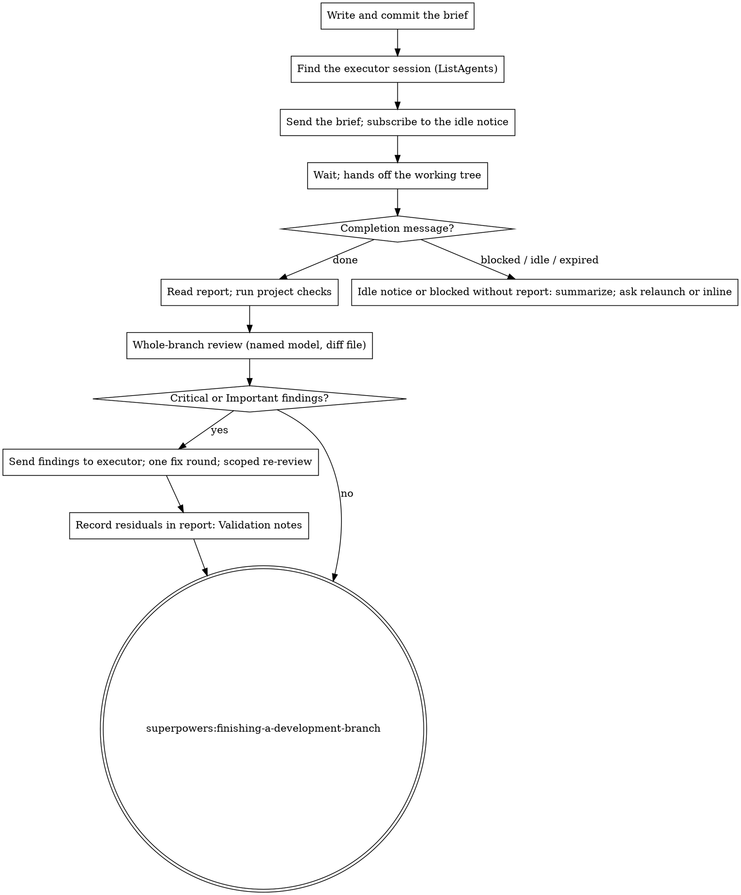

# Workflow Revision Part 2: Handoff, Delegated Execution, Inline Review, README — Implementation Plan

> **For agentic workers:** Use superpowers:executing-plans to implement this plan task-by-task, or superpowers:subagent-driven-development when tasks need a per-task review gate. TDD applies in both. Steps use checkbox (`- [ ]`) syntax for tracking.

**Goal:** Replace the writing-plans execution handoff with two modes (delegation to a second interactive session by default, inline on request), add the `delegating-execution` skill that briefs, waits for, and validates that session, give inline execution the same whole-branch review, and describe the fork in the README.

**Architecture:** One new skill, `delegating-execution` (SKILL.md and a brief template), owns the planning-session side of delegation: brief file, session discovery with `ListAgents`, handover with `SendMessage` and a one-shot idle subscription, validation with a whole-branch review, one fix round sent back to the executor, then finishing-a-development-branch. writing-plans' Execution Handoff block is rewritten to offer the two modes. executing-plans loses its "use SDD instead" sentence and gains the whole-branch review before finishing. README gains an "About this fork" section and the two new skills in its catalogue. The Part 1 structural test grows the assertions for these files.

**Tech Stack:** Markdown skill files, bash test script, graphviz `dot`, git, Claude Code cross-session messaging (`ListAgents`, `SendMessage` with `notify_when_idle`).

**Spec:** `docs/superpowers/specs/2026-09-13-workflow-revision-design.md` — sections 7.4, 8, 9, 11, plus the Part 2 items of 13.1 and 14. Part 1 (sections 5, 6, 7.1–7.3, 10) is already on the branch.

> **Executed 2026-09-13.** The whole-branch review afterwards changed the skill text this plan quotes in Tasks 2–5 (working directory instead of repository directory in the handoff, executor release step, `[MODEL]` and `[DIFF_FILE]` slots in `code-reviewer.md`, the executor's carve-out from the branch review and finishing). The repository is authoritative; do not re-execute this plan's literal blocks over it.

## Global Constraints

- Repository: the fork checkout, branch `workflow-revision`. All paths below are relative to its root.
- Git identity is repo-local and already set; every commit shows `30889176+ViktorGozhiy@users.noreply.github.com` as author and committer. Check with `git log --format='%ae %ce' -1` after each commit.
- No personal data in file content: no surnames, no employer domains, no work email addresses, no absolute paths of this machine.
- Reviewer model default, verbatim from `skills/reviewing-documents/SKILL.md`: "one tier below the model this session runs on, with `opus` as the floor". The whole-branch review in both execution modes uses the same default; the text says this deliberately differs from subagent-driven-development.
- Brief and report location: `docs/superpowers/briefs/YYYY-MM-DD-<topic>-brief.md` and `...-report.md`.
- Default execution mode: delegated, with a stop that asks the human to open a second session; inline only when the human says "inline".
- New text uses positive wording with the reason in the same sentence. Do not write `MUST`, `CRITICAL`, or `Do NOT rely on` in new text.
- Files not named in this plan are not edited. `skills/subagent-driven-development/` stays untouched.
- Skill frontmatter: `name` and `description` only; `description` starts with "Use when" and is written in third person.

---

### Task 1: Extend the structural test (red)

**Files:**
- Modify: `tests/claude-code/test-workflow-revision.sh` — add a variables block after line 17, a `-- delegating-execution skill` section between the brainstorming and writing-plans sections, and assertions under `-- writing-plans`; add a new `-- executing-plans and README` section before the final status block.

**Interfaces:**
- Consumes: the helpers already in the script (`assert_file`, `assert_contains`, `assert_not_contains`, `assert_skill_refs_resolve`, `assert_md_refs_resolve`, `assert_graph_parses`).
- Produces: the assertions Tasks 2–6 turn green.

- [ ] **Step 1: Add the file variables and guard the graph helper**

After the line `PLAN_PROMPT="$SKILLS/writing-plans/plan-document-reviewer-prompt.md"` add:

```bash
DELEGATING_SKILL="$SKILLS/delegating-execution/SKILL.md"
BRIEF_TEMPLATE="$SKILLS/delegating-execution/brief-template.md"
EXECUTING_PLANS="$SKILLS/executing-plans/SKILL.md"
README="$REPO_ROOT/README.md"
```

In `assert_graph_parses`, insert this line after the `local file="$1" label="$2" graph_file` declaration and before the `if ! command -v dot` line (the `local` line has to come first, or `set -u` reports `file` as unbound):

```bash
    [ -f "$file" ] || { fail "$label" "missing file: $file"; return; }
```

The script runs under `set -euo pipefail`; without the guard, `awk` on a missing file exits 2 and aborts the whole run before the `STATUS:` line, so the red run in Step 4 would have no report to read.

- [ ] **Step 2: Add the delegating-execution section**

Before the line `echo "-- writing-plans"` (and its preceding `echo ""`), insert the block below. It has to sit after the brainstorming section because `assert_graph_parses` is defined there (line 94) and bash resolves functions at call time:

```bash
echo ""
echo "-- delegating-execution skill"
assert_file "$DELEGATING_SKILL" "delegating-execution/SKILL.md exists"
assert_file "$BRIEF_TEMPLATE" "delegating-execution/brief-template.md exists"
assert_contains "$DELEGATING_SKILL" "name: delegating-execution" "delegating frontmatter name"
assert_contains "$DELEGATING_SKILL" "description: Use when" "delegating description starts with Use when"
assert_skill_refs_resolve "$DELEGATING_SKILL" "delegating-execution skill references resolve"
assert_md_refs_resolve "$DELEGATING_SKILL" "delegating-execution references resolve"
assert_contains "$DELEGATING_SKILL" "notify_when_idle" "delegating-execution subscribes to the idle notice"
assert_contains "$DELEGATING_SKILL" "ListAgents" "delegating-execution discovers sessions with ListAgents"
assert_contains "$DELEGATING_SKILL" "docs/superpowers/briefs/" "delegating-execution names the brief location"
assert_contains "$BRIEF_TEMPLATE" "[PLANNING_SESSION]" "brief template carries the planning session name"
assert_contains "$BRIEF_TEMPLATE" "[REPORT_PATH]" "brief template carries the report path"
assert_graph_parses "$DELEGATING_SKILL" "delegating-execution graph parses"
```

- [ ] **Step 3: Extend the writing-plans section and add the executing-plans and README section**

After the line `assert_contains "$WRITING_PLANS" "12 tasks" "writing-plans states the task-count threshold"` add:

```bash
assert_not_contains "$WRITING_PLANS" "Subagent-Driven (recommended)" "handoff no longer offers subagent-driven development"
assert_contains "$WRITING_PLANS" "superpowers:delegating-execution" "handoff routes to delegating-execution"
assert_contains "$WRITING_PLANS" "superpowers:executing-plans" "handoff keeps inline execution"

echo ""
echo "-- executing-plans and README"
assert_skill_refs_resolve "$EXECUTING_PLANS" "executing-plans skill references resolve"
assert_not_contains "$EXECUTING_PLANS" "instead of this skill" "executing-plans no longer defers to subagent-driven development"
assert_contains "$EXECUTING_PLANS" "superpowers:requesting-code-review" "executing-plans runs the whole-branch review"
assert_contains "$README" "## About this fork" "README describes the fork"
assert_contains "$README" "**reviewing-documents**" "README lists reviewing-documents"
assert_contains "$README" "**delegating-execution**" "README lists delegating-execution"
```

- [ ] **Step 4: Run the test to see the new assertions fail**

Run: `bash tests/claude-code/test-workflow-revision.sh`
Expected: `STATUS: FAILED (19 failures)`: every line under `-- delegating-execution skill` (12), two of the three new `-- writing-plans` lines (`handoff keeps inline execution` already passes, because the v6.3.0 handoff mentions `superpowers:executing-plans`), and under `-- executing-plans and README` the two `executing-plans` content lines and the three README lines. `executing-plans skill references resolve` passes (its references exist). All Part 1 lines still pass.

- [ ] **Step 5: Commit**

```bash
git add tests/claude-code/test-workflow-revision.sh
git commit -m "test: add structural checks for delegated execution and the README section"
git log --format='%ae %ce' -1
```

---

### Task 2: Brief template

**Files:**
- Create: `skills/delegating-execution/brief-template.md`

**Interfaces:**
- Consumes: nothing.
- Produces: placeholders `[TOPIC]`, `[DATE]`, `[BRANCH]`, `[PLAN_PATH]`, `[SPEC_PATH]`, `[ACCEPTANCE]`, `[PROJECT_CHECKS]`, `[REPORT_PATH]`, `[PLANNING_SESSION]`, `[PLAN_LITERAL]` that Task 3 fills.

- [ ] **Step 1: Write the template**

````markdown
# Execution Brief Template

The planning session fills this template into `docs/superpowers/briefs/[DATE]-[TOPIC]-brief.md`, commits it, and points the executor session at it. The brief is the executor's requirements; the plan and the spec are what it builds from.

**Placeholders:**
- `[TOPIC]`, `[DATE]` — same as the plan's file name
- `[BRANCH]` — the feature branch the executor works on
- `[PLAN_PATH]`, `[SPEC_PATH]` — absolute paths
- `[ACCEPTANCE]` — where the acceptance criteria live (a spec section, an issue reference)
- `[PROJECT_CHECKS]` — the project's quality gates, one line each (build, tests, lint, formatter), taken from the project's instructions file
- `[REPORT_PATH]` — `docs/superpowers/briefs/[DATE]-[TOPIC]-report.md`
- `[PLANNING_SESSION]` — the planning session's own name as printed at the top of `ListAgents`
- `[PLAN_LITERAL]` — `yes` when the plan carries the code and its review verified it against the tree, otherwise `no`

```markdown
# Execution brief: [TOPIC]

Read this file first; it is your requirements. Then read the plan and the spec.

## What to build

- Plan: `[PLAN_PATH]`
- Spec: `[SPEC_PATH]` (the plan argues from it; conflicts inside the plan resolve against the spec)
- Acceptance criteria: [ACCEPTANCE]
- Branch: `[BRANCH]`. Work here; every commit lands on this branch.

## Method

Choose the method that is most effective for you: inline, subagents, or a mix.
Plan is literal (code present, verified against the tree): [PLAN_LITERAL].
When it is, transcription plus tests is enough and a review per task adds little.
When it is not, `superpowers:subagent-driven-development` gives each task its own
review gate. Either way, superpowers:test-driven-development applies to every task.

## Non-negotiables

- One green commit per plan task, in plan order, with the plan's commit message.
- The project's checks pass before each commit:
[PROJECT_CHECKS]
- Follow the project's instructions file for conventions and mechanics.
- Any reviewer you dispatch works in a git worktree, never in this working tree:
  a reviewer that edits files here races your own build.

## Hard limits

- No push, no pull request, no merge.
- No edits outside the plan's file map unless the code forces it; record every such edit under Deviations.
- No destructive operations: no history rewrites, no resets that drop work, no deletions the plan does not name.
- No other branches; no changes to the planning documents.

## When the code disagrees with the plan

Follow the code, record the deviation and its reason in the report, and continue.
Stop only for a defect that leaves every path forward a guess; then write the report
with what you know and send the blocked signal below.

## Report

Write `[REPORT_PATH]` as you go and finish it before you signal. Sections:

- **Timing:** start and end time, wall clock.
- **Method:** inline, subagents, or mix; number of subagents dispatched and their models.
- **Tasks:** one line per plan task: task number, commit hash, one-line test summary.
- **Deviations:** every departure from the plan, with the reason.
- **Evidence:** the commands you ran for the project's checks and their final lines.
- **Open questions:** anything the planning session has to decide.

## Completion signal

Your last action: send one message to the session named `[PLANNING_SESSION]`
with `SendMessage`. First line, exactly one of:

- `Execution done: [REPORT_PATH]`
- `Execution blocked: [REPORT_PATH]`

The planning session validates the branch after your message; it may send you
findings to fix, so stay available until it says the work is finished.
```
````

- [ ] **Step 2: Run the structural test**

Run: `bash tests/claude-code/test-workflow-revision.sh`
Expected: under `-- delegating-execution skill` the lines `brief-template.md exists`, `brief template carries the planning session name`, `brief template carries the report path` pass; the rest of that section still fails.

- [ ] **Step 3: Commit**

```bash
git add skills/delegating-execution/brief-template.md
git commit -m "feat: add execution brief template for delegated execution"
git log --format='%ae %ce' -1
```

---

### Task 3: Skill `delegating-execution`

**Files:**
- Create: `skills/delegating-execution/SKILL.md`

**Interfaces:**
- Consumes: `brief-template.md` (Task 2); `../requesting-code-review/code-reviewer.md`; `../subagent-driven-development/re-review-prompt.md`; `../reviewing-documents/SKILL.md` for the model default; skills `superpowers:finishing-a-development-branch`, `superpowers:executing-plans`, `superpowers:requesting-code-review`.
- Produces: the skill name `superpowers:delegating-execution` that Task 4's handoff routes to.

- [ ] **Step 1: Write the skill file**

````markdown
---
name: delegating-execution
description: Use when an implementation plan has passed review and the human has opened a second interactive session to execute it, so the planning session can brief that session, wait for its report, validate the result, and finish the branch
---

# Delegating Execution

The planning session hands a reviewed plan to a second interactive session that your human partner opened and is watching. This session writes the brief, sends it, waits, validates the result with a whole-branch review, and finishes the branch. Its context stays free for the dialogue and for the validation.

**Announce at start:** "I'm using the delegating-execution skill to hand the plan to the executor session."

## Why a second session

- The executor runs on the model your partner chose when launching it, usually a cheaper one than this session's. The planning model's budget is what delegation protects.
- Your partner sees a full interactive terminal and can step in, which neither a background subagent nor a headless run gives them.
- Execution never enters this session's context, so the validation at the end reads the branch with fresh eyes.

## The flow



## Preconditions

- The plan and the spec are committed on the feature branch and the plan has passed `superpowers:reviewing-documents`.
- Your partner has said that a second session is running in the repository directory. You do not choose its model; they did when they launched it.

## 1. Write the brief

Fill `brief-template.md` into `docs/superpowers/briefs/YYYY-MM-DD-<topic>-brief.md`, with the same date and topic as the plan. Take the project's checks from its instructions file, set `[PLAN_LITERAL]` from the plan review (code present and verified against the tree, or not), and put this session's own name into `[PLANNING_SESSION]`: `ListAgents` prints it on its first line. Commit: `docs: add execution brief for <topic>`.

## 2. Find the executor session

Run `ListAgents`. After this session's own name it lists reachable sessions, one row each: `name [ref]`, busy or idle, start time. Session names derive from the working directory, so choose the most recently started idle session whose name begins with the repository directory's name. When more than one qualifies, ask your partner which one; when two rows share a name, address the chosen one with its `[ref]`.

## 3. Hand over

Call `SendMessage` with `to` set to the executor's name, `notify_when_idle: true`, and this message:

> Execution brief: read `<brief path>` first; it is your requirements, and it names the plan, the spec, the report file, and how to signal completion. Report to the session named `<this session's name>`.

`notify_when_idle` subscribes, in the same call, to one notice when the executor next goes idle or exits. It is one-shot, works for sessions on this machine, and only from the main conversation, not from a subagent.

Then wait. Leave the working tree alone until the executor has reported: two sessions editing one checkout race each other's builds. Do not poll `ListAgents` and do not send "are you done" messages; your partner is watching the executor's terminal, and the messages below reach you on their own.

- The completion message arrives as `<cross-session-message from="…">` with a first line `Execution done: <report path>` or `Execution blocked: <report path>`. To reply, copy its `from` into `to`.
- The `[Cross-session idle notice]` is the fallback for a run that ended without reporting; a notice saying the subscription expired is handled the same way (section 5).

On a harness without `ListAgents` and `SendMessage`, say so and ask your partner to paste the brief into the executor and to tell you when it reports.

## 4. Validate

1. Read the report. Every plan task has a commit; every deviation has a reason. A missing commit or an unexplained deviation is a finding for step 4.
2. Run the project's full checks yourself (build and tests), or dispatch one subagent that runs them and returns only the final lines.
3. Dispatch the whole-branch review with `superpowers:requesting-code-review` and its `../requesting-code-review/code-reviewer.md`. Name the model: the same default as document reviews, one tier below this session's model with `opus` as the floor (see `../reviewing-documents/SKILL.md`). This deliberately differs from subagent-driven-development, which puts its final review on the most capable model: here the most capable model is this session's, and its budget is what delegation protects. Hand the reviewer a diff file, not pasted text: `git log --oneline <merge-base>..HEAD`, `git diff --stat <merge-base>..HEAD`, and `git diff -U10 <merge-base>..HEAD` written to one file in your scratch directory, where `<merge-base>` is `git merge-base <main branch> HEAD`. Give it the plan path, the report path, and the plan's `## Review notes` if any.
4. When the review returns Critical or Important findings, send the complete list to the executor in one `SendMessage` call with `notify_when_idle: true`: its context is intact and it fixes cheaper than you would. Ask it to append a fix report to the same report file and to signal `Execution done` again. Then run one scoped re-review with `../subagent-driven-development/re-review-prompt.md`, filling its placeholders as follows: `[MODEL]` the same model as step 3; `[BRIEF_FILE]` the executor brief; `[FINDINGS]` the findings you sent, verbatim; `[REPORT_FILE]` the executor report with the fix report appended; `[FIX_BASE_SHA]` HEAD at the time of the whole-branch review; `[HEAD_SHA]` HEAD after the fixes; `[DIFF_FILE]` a file holding `git log --oneline`, `git diff --stat`, and `git diff -U10` for that range. SDD's `scripts/review-package` is not used because it writes into SDD's per-plan workspace. One fix round only: adjudicate whatever remains and record each ruling in the report under `## Validation notes`, so a decision you took reaches your partner.
5. Invoke `superpowers:finishing-a-development-branch` from this session: it holds the dialogue context, so it presents the options and opens the pull request.

## 5. When the executor stops without reporting

An idle notice or an expired subscription with no completion message, or a message starting `Execution blocked`: read `git log` on the branch and whatever the report holds, summarize the state to your partner in a few lines, and ask which they prefer:

- relaunch: they open a fresh session, you write a brief whose `## What to build` names the remaining tasks and the last good commit, and you hand over again;
- inline: you finish the remaining tasks here with `superpowers:executing-plans`.

## Common Rationalizations

| Excuse | Reality |
|--------|---------|
| "I'll just execute it here, the second session is overhead" | Your partner asked for delegation because your model is the expensive one and your context is for validation. Inline is theirs to choose, with the word "inline". |
| "I'll check the executor's progress with ListAgents every minute" | Polling spends your turns for nothing; the completion message and the idle notice arrive on their own. |
| "The executor is done, I'll fix the review findings myself" | The executor holds the context of the code it wrote and fixes cheaper. One message, one fix round. |
| "The plan was literal, the whole-branch review can be skipped" | The review is what turns "matches the plan" into "and the plan's own mistakes are fixed". It runs in both execution modes. |
| "I'll tidy one file while the executor works" | Two sessions editing one checkout race each other's builds. Hands off until the report. |
````

- [ ] **Step 2: Run the structural test**

Run: `bash tests/claude-code/test-workflow-revision.sh`
Expected: every line under `-- delegating-execution skill` passes, including `delegating-execution graph parses`. The `-- writing-plans` additions and the `-- executing-plans and README` section still fail.

- [ ] **Step 3: Commit**

```bash
git add skills/delegating-execution/SKILL.md
git commit -m "feat: add delegating-execution skill"
git log --format='%ae %ce' -1
```

---

### Task 4: Writing-plans execution handoff

**Files:**
- Modify: `skills/writing-plans/SKILL.md` — the `## Execution Handoff` section (lines 149–167)

**Interfaces:**
- Consumes: `superpowers:delegating-execution` (Task 3), `superpowers:executing-plans`.
- Produces: the two-mode handoff message.

- [ ] **Step 1: Replace the section**

Replace:

```markdown
## Execution Handoff

After saving the plan, offer execution choice:

**"Plan complete and saved to `docs/superpowers/plans/<filename>.md`. Two execution options:**

**1. Subagent-Driven (recommended)** - I dispatch a fresh subagent per task, review between tasks, fast iteration

**2. Inline Execution** - Execute tasks in this session using executing-plans, batch execution with checkpoints

**Which approach?"**

**If Subagent-Driven chosen:**
- **REQUIRED SUB-SKILL:** Use superpowers:subagent-driven-development
- Fresh subagent per task + two-stage review

**If Inline Execution chosen:**
- **REQUIRED SUB-SKILL:** Use superpowers:executing-plans
- Batch execution with checkpoints for review
```

with:

```markdown
## Execution Handoff

After the review, send one message with: the plan path; rounds run; whether the reviewer verified the plan against the tree; the plan's `## Review notes`, if any; the reviewers' advice that did not change the plan. Then ask:

> "Open a second session in the repository directory (for example `claude --model opus`; the model is your choice) and tell me when it is ready. Or say "inline" to execute the plan in this session."

Wait for the answer.

- The session is ready: use `superpowers:delegating-execution`. A second interactive session executes on the model your partner chose, they watch it live, and this session keeps its context for validating the result.
- "inline": use `superpowers:executing-plans` here.

Subagent-driven development is not offered at this point: a plan that carries the code and was verified against the tree does not need a review gate per task, and the executor session can still choose `superpowers:subagent-driven-development` for a descriptive plan; the plan header names it for that reason.
```

- [ ] **Step 2: Run the structural test**

Run: `bash tests/claude-code/test-workflow-revision.sh`
Expected: the two red `-- writing-plans` lines flip to green (the third was already green). Only `-- executing-plans and README` content lines still fail.

- [ ] **Step 3: Commit**

```bash
git add skills/writing-plans/SKILL.md
git commit -m "feat: hand plans to a second session by default, inline on request"
git log --format='%ae %ce' -1
```

---

### Task 5: Executing-plans keeps the whole-branch review

**Files:**
- Modify: `skills/executing-plans/SKILL.md` — the Note under Overview (line 14) and Step 3 (lines 33–38)

**Interfaces:**
- Consumes: `superpowers:requesting-code-review`, `../reviewing-documents/SKILL.md` model default.
- Produces: the inline mode's final review step.

- [ ] **Step 1: Trim the note**

Replace:

```markdown
**Note:** Tell your human partner that Superpowers works much better with access to subagents (Claude Code, Codex CLI, Codex App, Copilot CLI, and Gemini CLI all qualify; see the per-platform tool refs in `../using-superpowers/references/`). If subagents are available, use superpowers:subagent-driven-development instead of this skill.
```

with:

```markdown
**Note:** Tell your human partner that Superpowers works much better with access to subagents (Claude Code, Codex CLI, Codex App, Copilot CLI, and Gemini CLI all qualify; see the per-platform tool refs in `../using-superpowers/references/`). The whole-branch review in Step 3 needs one.
```

- [ ] **Step 2: Add the review to Step 3**

Replace:

```markdown
### Step 3: Complete Development

After all tasks complete and verified:
- Announce: "I'm using the finishing-a-development-branch skill to complete this work."
- **REQUIRED SUB-SKILL:** Use superpowers:finishing-a-development-branch
- Follow that skill to verify tests, present options, execute choice
```

with:

```markdown
### Step 3: Review the Whole Branch

After all tasks complete and verified, dispatch one reviewer with fresh context over the whole branch: use superpowers:requesting-code-review with its `code-reviewer.md`, name the model (one tier below this session's model, `opus` as the floor, as in `../reviewing-documents/SKILL.md`), and hand it a diff file from `git merge-base <main branch> HEAD` to `HEAD` instead of pasted text. You wrote every commit on this branch, so you read them the way you meant them; the reviewer reads what is there. Fix Critical and Important findings, commit each fix, and re-run the project's checks. Note Minor findings for your human partner.

### Step 4: Complete Development

- Announce: "I'm using the finishing-a-development-branch skill to complete this work."
- **REQUIRED SUB-SKILL:** Use superpowers:finishing-a-development-branch
- Follow that skill to verify tests, present options, execute choice
```

- [ ] **Step 3: Run the structural test**

Run: `bash tests/claude-code/test-workflow-revision.sh`
Expected: the two `executing-plans` content lines pass; only the three README lines still fail.

- [ ] **Step 4: Commit**

```bash
git add skills/executing-plans/SKILL.md
git commit -m "feat: review the whole branch before finishing an inline execution"
git log --format='%ae %ce' -1
```

---

### Task 6: README and tests README

**Files:**
- Modify: `README.md` — Table of Contents (after line 7), a new section before `## Commercial Services` (line 45), The Basic Workflow step 4 (line 269), the Skills Library list (line 301)
- Modify: `tests/claude-code/README.md` — the `### Fast Tests (run by default)` list (after line 93)

**Interfaces:**
- Consumes: nothing.
- Produces: the README strings Task 1 asserts.

- [ ] **Step 1: Table of contents**

Replace:

```markdown
- [How it works](#how-it-works)
- [Commercial Services](#commercial-services)
```

with:

```markdown
- [How it works](#how-it-works)
- [About this fork](#about-this-fork)
- [Commercial Services](#commercial-services)
```

- [ ] **Step 2: Add the section**

Insert before `## Commercial Services`:

```markdown
## About this fork

This fork tracks upstream Superpowers and changes three things in the workflow. Specs and plans are reviewed by fresh subagents on an explicitly named model in a bounded loop (`reviewing-documents`: one full review, scoped re-reviews of the fixes, three rounds, then recorded rulings). After the spec review, brainstorming continues to writing-plans on its own when the review changed nothing the human agreed to, and stops with an "agreed / now" comparison when it did. Execution is delegated by default to a second interactive session that the human opens and watches (`delegating-execution`), with the planning session validating the result; inline execution stays available on request, and subagent-driven development stays in the library for the executor to choose. The design is in `docs/superpowers/specs/2026-09-13-workflow-revision-design.md`. "How it works" above describes upstream's flow; in this fork the step after "go" is the handoff described here. The `team-design` branch holds an earlier, archived experiment with role-based design sessions.

```

- [ ] **Step 3: The Basic Workflow step 4**

Replace:

```markdown
4. **subagent-driven-development** or **executing-plans** - Activates with plan. Dispatches fresh subagent per task with two-stage review (spec compliance, then code quality), or executes in batches with human checkpoints.
```

with:

```markdown
4. **delegating-execution** or **executing-plans** - Activates with a reviewed plan. Hands the plan to a second interactive session that the human watches, then validates the result with a whole-branch review; or executes inline in this session with the same final review. The executor session may use **subagent-driven-development** for a descriptive plan.
```

- [ ] **Step 4: Skills Library list**

Replace:

```markdown
- **executing-plans** - Batch execution with checkpoints
```

with:

```markdown
- **executing-plans** - Batch execution with checkpoints
- **reviewing-documents** - Fresh-subagent review of specs and plans in a bounded loop
- **delegating-execution** - Hand a reviewed plan to a second session, then validate the branch
```

- [ ] **Step 5: Tests README**

In `tests/claude-code/README.md`, after the block that ends with `- Task context provision documented` (line 93), add:

```markdown

#### test-workflow-revision.sh
Structural checks for the document review loop and delegated execution (seconds, no Claude calls):
- `reviewing-documents` and `delegating-execution` skill files exist and their references resolve
- Reviewer prompt templates name a model; the plan template checks the tree
- brainstorming and writing-plans invoke `reviewing-documents`; inline self-review blocks are gone
- The writing-plans handoff offers delegated and inline execution
- The `dot` graphs in brainstorming, reviewing-documents, and delegating-execution parse
- README describes the fork and lists the two new skills

Behaviour probes for the same changes are recorded in `probes/workflow-revision-probes.md`.
```

- [ ] **Step 6: Run the structural test**

Run: `bash tests/claude-code/test-workflow-revision.sh`
Expected: `STATUS: PASSED`, every line `[PASS]`.

- [ ] **Step 7: Commit**

```bash
git add README.md tests/claude-code/README.md
git commit -m "docs: describe the fork and list the new skills"
git log --format='%ae %ce' -1
```

---

### Task 7: Behaviour probe F — the handoff stops and offers two modes

**Files:**
- Modify: `tests/claude-code/probes/workflow-revision-probes.md` — add a `## Probe F` section before `## Summary` and a row to the table

- [ ] **Step 1: Run the probe**

Reuse the Probe A fixture, or recreate it with "Step 1: Create the fixture repository" of Part 1's probes task (Task 8 there). From the fixture directory, with `<REPO_ROOT>` the fork checkout:

```bash
claude -p "Use the superpowers writing-plans skill to write the implementation plan for docs/superpowers/specs/2026-09-13-farewell-design.md. Follow the skill to its end, including the execution handoff, and stop where it tells you to wait for me." \
  --model opus --plugin-dir "<REPO_ROOT>" \
  --settings '{"enabledPlugins":{"superpowers@superpowers-marketplace":false}}' \
  --permission-mode bypassPermissions --output-format stream-json --verbose > probe-f.jsonl 2>&1
grep -o '"name":"Agent"[^}]*' probe-f.jsonl | head -5
grep -c 'delegating-execution' probe-f.jsonl
tail -c 2500 probe-f.jsonl
```

Expected: one plan reviewer dispatch on `opus` (read off the Agent entry); the final message asks to open a second session in the repository directory or to say "inline", mentions whether the plan was verified against the tree, and does not offer subagent-driven development; no execution happened (no code files under `src/` changed, `git log` shows only the plan commits).

- [ ] **Step 2: Record and commit**

Add the probe section (purpose, prompt, observed dispatches and models, the closing message verbatim, verdict) and the table row `| F | 1 (opus) | handoff: two modes, waits | yes |`. Update the total cost line.

```bash
git add tests/claude-code/probes/workflow-revision-probes.md
git commit -m "test: record probe F for the two-mode execution handoff"
git log --format='%ae %ce' -1
```

The end-to-end delegation itself (a planning session briefing a second interactive session, waiting, validating) needs a human at the second terminal; it is exercised in Task 9 and recorded as Probe G there.

---

### Task 8: Whole-branch verification and review

**Files:**
- No file changes unless the checks fail.

- [ ] **Step 1: Fast tests**

Run: `bash tests/claude-code/run-skill-tests.sh --test test-workflow-revision.sh`
Expected: `Passed:  1`, `STATUS: PASSED`.

Run: `bash tests/writing-skills/test-render-graphs.sh`
Expected: last line `Results: 8 passed, 0 failed`.

- [ ] **Step 2: Personal-data and identity check**

```bash
git log --format='%an %ae %cn %ce' origin/main..HEAD | sort -u
grep -rIniE 'hozhyi|gozhiy|schoolday|gg4l|/home/|claude-homes' . --exclude-dir=.git | grep -v 'users.noreply.github.com' || echo "no personal data"
```

Expected: one identity line whose two email fields are both the noreply address; `no personal data`.

- [ ] **Step 3: Whole-branch review of Part 2**

Dispatch `superpowers:requesting-code-review` with `code-reviewer.md`, `model: opus`, `[BASE_SHA]` = the Part 2 plan commit (`git log --format=%H -1 -- docs/superpowers/plans/2026-09-13-workflow-revision-part-2-delegated-execution.md` run before Task 7 changes anything else; the plan file's last commit at the time of execution), so the diff holds only Part 2's implementation, `[HEAD_SHA]` = `HEAD`, a diff file as in `delegating-execution` step 4.3, and this plan's and the spec's paths. Fix Critical and Important findings, one commit per fix, then one scoped re-review of the fix range with `subagent-driven-development/re-review-prompt.md`. Record residual rulings in the probes file under a `## Validation notes` heading.

- [ ] **Step 4: Push**

```bash
git push origin workflow-revision
```

---

### Task 9: Rollout and live probe G

**Files:**
- Modify: `tests/claude-code/probes/workflow-revision-probes.md` — `## Probe G` section and table row, after the live run

- [ ] **Step 1: Merge to the fork's main**

Use `superpowers:finishing-a-development-branch`. The human decides between a pull request on the fork and a direct merge; either way `main` ends at the branch head and the branch is deleted after merge.

- [ ] **Step 2: Reinstall the plugin from the fork marketplace**

In Claude Code: remove `superpowers@superpowers-marketplace`, install `superpowers@superpowers-dev` (the marketplace already registered for the fork; its `.claude-plugin/marketplace.json` has `"source": "./"`). Start a new session and confirm the loaded `using-superpowers` bootstrap comes from the fork (the skill list in `/help` or a Skill invocation shows the fork's base directory).

- [ ] **Step 3: Live probe G — delegated execution end to end**

With the human at a second terminal:

1. In a fixture repository (Probe A's shape), the planning session runs `superpowers:brainstorming` for a small architectural change, then `superpowers:writing-plans`, and stops at the new handoff.
2. The human opens `claude --model opus` in the fixture directory and says "ready".
3. The planning session runs `superpowers:delegating-execution`: writes and commits the brief, finds the session with `ListAgents`, sends the brief with `notify_when_idle: true`, and waits.
4. The human watches the executor implement the plan and send `Execution done: <report path>`.
5. The planning session validates: reads the report, runs the checks, dispatches the whole-branch review on `opus`, sends findings back if any, runs the scoped re-review, and invokes finishing-a-development-branch.

Record in the probes file: each step's observed behaviour, the executor's method and model, the number of messages exchanged, whether the idle notice arrived, the review outcome, wall clock and cost from both sessions, and the verdict against spec sections 7.4 and 8. Commit as `test: record live probe G for delegated execution` and push.
