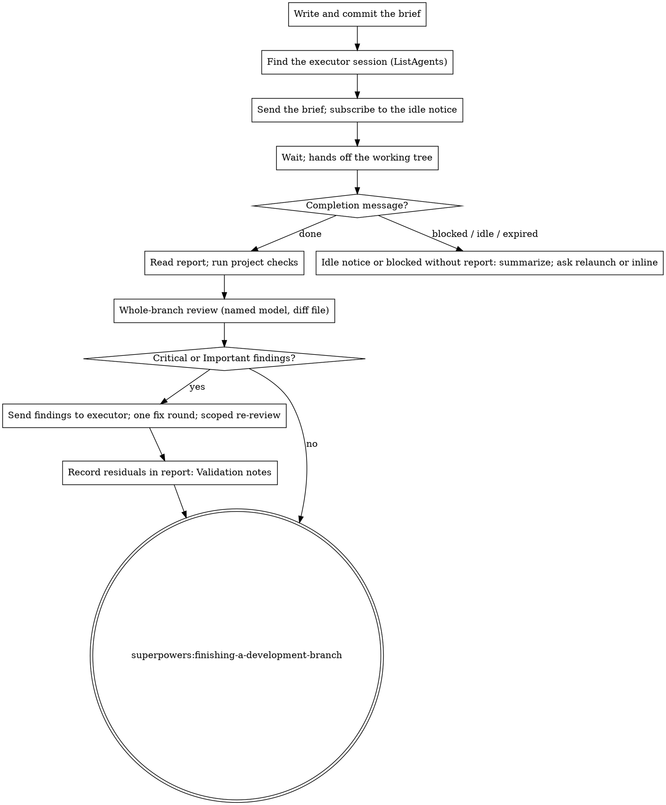

# Delegating Execution

The planning session hands a reviewed plan to a second interactive session that your human partner opened and is watching. This session writes the brief, sends it, waits, validates the result with a whole-branch review, and finishes the branch. Its context stays free for the dialogue and for the validation.

**Announce at start:** "I'm using the delegating-execution skill to hand the plan to the executor session."

## Why a second session

- The executor runs on the model your partner chose when launching it, usually a cheaper one than this session's. The planning model's budget is what delegation protects.
- Your partner sees a full interactive terminal and can step in, which neither a background subagent nor a headless run gives them.
- Execution never enters this session's context, so the validation at the end reads the branch with fresh eyes.

## The flow

## Preconditions

- The plan and the spec are committed on the feature branch and the plan has passed `superpowers:reviewing-documents`.
- Your partner has said that a second session is running in the repository directory. You do not choose its model; they did when they launched it.

## 1. Write the brief

Fill `brief-template.md` into `docs/superpowers/briefs/YYYY-MM-DD-<topic>-brief.md`, with the same date and topic as the plan. Take the project's checks from its instructions file, set `[PLAN_LITERAL]` from the plan review (code present and verified against the tree, or not), and put this session's own name into `[PLANNING_SESSION]`: `ListAgents` prints it on its first line. Commit: `docs: add execution brief for <topic>`.

## 2. Find the executor session

Run `ListAgents`. After this session's own name it lists reachable sessions, one row each: `name [ref]`, busy or idle, start time. Session names derive from the working directory, so choose the most recently started idle session whose name begins with the repository directory's name. When more than one qualifies, ask your partner which one; when two rows share a name, address the chosen one with its `[ref]`.

## 3. Hand over

Call `SendMessage` with `to` set to the executor's name, `notify_when_idle: true`, and this message:

> Execution brief: read `<brief path>` first; it is your requirements, and it names the plan, the spec, the report file, and how to signal completion. Report to the session named `<this session's name>`.

`notify_when_idle` subscribes, in the same call, to one notice when the executor next goes idle or exits. It is one-shot, works for sessions on this machine, and only from the main conversation, not from a subagent.

Then wait. Leave the working tree alone until the executor has reported: two sessions editing one checkout race each other's builds. Do not poll `ListAgents` and do not send "are you done" messages; your partner is watching the executor's terminal, and the messages below reach you on their own.

- The completion message arrives as `<cross-session-message from="…">` with a first line `Execution done: <report path>` or `Execution blocked: <report path>`. To reply, copy its `from` into `to`.
- The `[Cross-session idle notice]` is the fallback for a run that ended without reporting; a notice saying the subscription expired is handled the same way (section 5).

On a harness without `ListAgents` and `SendMessage`, say so and ask your partner to paste the brief into the executor and to tell you when it reports.

## 4. Validate

1. Read the report. Every plan task has a commit; every deviation has a reason. A missing commit or an unexplained deviation is a finding for step 4.
2. Run the project's full checks yourself (build and tests), or dispatch one subagent that runs them and returns only the final lines.
3. Dispatch the whole-branch review with `superpowers:requesting-code-review` and its `../requesting-code-review/code-reviewer.md`. Name the model: the same default as document reviews, one tier below this session's model with `opus` as the floor (see `../reviewing-documents/SKILL.md`). This deliberately differs from subagent-driven-development, which puts its final review on the most capable model: here the most capable model is this session's, and its budget is what delegation protects. Hand the reviewer a diff file, not pasted text: `git log --oneline <merge-base>..HEAD`, `git diff --stat <merge-base>..HEAD`, and `git diff -U10 <merge-base>..HEAD` written to one file in your scratch directory, where `<merge-base>` is `git merge-base <main branch> HEAD`. Give it the plan path, the report path, and the plan's `## Review notes` if any.
4. When the review returns Critical or Important findings, send the complete list to the executor in one `SendMessage` call with `notify_when_idle: true`: its context is intact and it fixes cheaper than you would. Ask it to append a fix report to the same report file and to signal `Execution done` again. Then run one scoped re-review with `../subagent-driven-development/re-review-prompt.md`, filling its placeholders as follows: `[MODEL]` the same model as step 3; `[BRIEF_FILE]` the executor brief; `[FINDINGS]` the findings you sent, verbatim; `[REPORT_FILE]` the executor report with the fix report appended; `[FIX_BASE_SHA]` HEAD at the time of the whole-branch review; `[HEAD_SHA]` HEAD after the fixes; `[DIFF_FILE]` a file holding `git log --oneline`, `git diff --stat`, and `git diff -U10` for that range. SDD's `scripts/review-package` is not used because it writes into SDD's per-plan workspace. One fix round only: adjudicate whatever remains and record each ruling in the report under `## Validation notes`, so a decision you took reaches your partner.
5. Invoke `superpowers:finishing-a-development-branch` from this session: it holds the dialogue context, so it presents the options and opens the pull request.

## 5. When the executor stops without reporting

An idle notice or an expired subscription with no completion message, or a message starting `Execution blocked`: read `git log` on the branch and whatever the report holds, summarize the state to your partner in a few lines, and ask which they prefer:

- relaunch: they open a fresh session, you write a brief whose `## What to build` names the remaining tasks and the last good commit, and you hand over again;
- inline: you finish the remaining tasks here with `superpowers:executing-plans`.

## Common Rationalizations

| Excuse | Reality |
|--------|---------|
| "I'll just execute it here, the second session is overhead" | Your partner asked for delegation because your model is the expensive one and your context is for validation. Inline is theirs to choose, with the word "inline". |
| "I'll check the executor's progress with ListAgents every minute" | Polling spends your turns for nothing; the completion message and the idle notice arrive on their own. |
| "The executor is done, I'll fix the review findings myself" | The executor holds the context of the code it wrote and fixes cheaper. One message, one fix round. |
| "The plan was literal, the whole-branch review can be skipped" | The review is what turns "matches the plan" into "and the plan's own mistakes are fixed". It runs in both execution modes. |
| "I'll tidy one file while the executor works" | Two sessions editing one checkout race each other's builds. Hands off until the report. |
