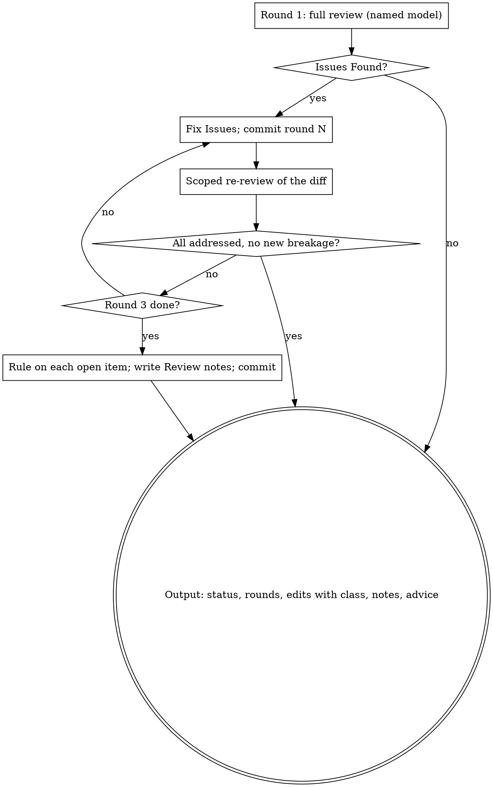

# Reviewing Documents

Review a spec or a plan with reviewer subagents that read it without the history of writing it, until it is approved or the round cap is reached, then report what changed.

**Announce at start:** "I'm using the reviewing-documents skill to review the <spec|plan>."

**Called by:** brainstorming (spec, architectural path) and writing-plans (plan). Your human partner does not invoke it directly.

## Why a fresh reader, and why only one full read

You wrote the document, so you read it the way you meant it. A reviewer subagent reads only what is on the page and therefore notices what you treat as obvious: the requirement that lives in your head, the two sections that quietly disagree, the plan step that assumes a function the repository does not have. One full read finds those.

Repeated full reads do not converge: every fresh reader also brings a fresh set of taste findings. So this skill runs one full review and then verifies fixes only.

## The loop

## Inputs

- `document`: absolute path of the spec or plan. It is already committed.
- `kind`: `spec` or `plan`.
- `spec` (plans only): absolute path of the spec the plan implements.

## Model

Name the model on every dispatch. Default: one tier below the model this session runs on, with `opus` as the floor. In Claude Code that is `model: opus` for a session on Fable or on Opus, and still `opus` for a session on Sonnet, because reading a whole design or plan for defects is a judgment task. An unnamed model inherits this session's model, usually the most expensive one, and that cost is what this default avoids.

## Round 1: full review

Dispatch a fresh `general-purpose` subagent with the template for the kind:

- `spec`: `../brainstorming/spec-document-reviewer-prompt.md` with `[SPEC_FILE_PATH]` = `document`.
- `plan`: `../writing-plans/plan-document-reviewer-prompt.md` with `[PLAN_FILE_PATH]` = `document` and `[SPEC_FILE_PATH]` = `spec`.

Both templates return `Status: Approved | Issues Found`, a list of `Issues` (blocking), and `Recommendations` (advisory).

- `Approved`: go to Output with zero edits. Any Recommendations go to the caller as advice; an approved document is not edited.
- `Issues Found`: fix every Issue in the document. Apply a Recommendation only when it clearly improves the document, and only in this revision: a Recommendation on its own never starts a round, because rounds exist for defects that would mislead the next stage. Before editing, record the commit the reviewer read (`git rev-parse HEAD`); every re-review diffs from the commit its predecessor read. Then commit the revision: `docs: address <spec|plan> review round 1`.

## Rounds 2 and 3: scoped re-review

After each revision, dispatch a fresh subagent with `re-review-prompt.md`:

- `[FINDINGS]`: the Issues from the previous round, verbatim.
- `[DOCUMENT]`: `document`.
- `[DIFF_FILE]`: the output of `git diff <commit the previous round reviewed> HEAD -- <document>`, written to a file in your scratch directory. Pass the path, not the text: a pasted diff stays in your context for the rest of the session.

The re-reviewer verdicts each finding `ADDRESSED` or `NOT ADDRESSED` and lists `New breakage`: contradictions or placeholders that the revision itself introduced. It does not read untouched text for new findings; if it reports an observation outside the findings list anyway, pass it to the caller in Output as advice and leave the document alone, because writing it into the document would turn a taste remark into a stop for the human.

When the re-reviewer returns `All findings addressed` and no new breakage, the loop is done: go to Output. Otherwise record HEAD, fix the open findings and the new breakage, commit (`docs: address <spec|plan> review round 2`), and re-review. Round 3 is the last re-review.

## The cap

Three rounds: one full review and two scoped re-reviews. When findings or new breakage are still open after round 3, rule on each one yourself:

- fix it now when the fix is small and clearly right;
- otherwise leave it and record why.

Write every ruling into the document under a final heading `## Review notes`, one bullet per open finding: the finding, the ruling, the reason. Only open findings and open new breakage go there; observations outside the findings list stay out of the document. Commit the fixes and the notes together (`docs: record <spec|plan> review notes`). The section travels with the document to your human partner and to whoever executes the plan, so a finding you overruled is still visible to them.

## Output

Return to the calling skill, in prose:

- status: `Approved` or `Approved with N review notes`;
- rounds run;
- edits made, one line each, and for each edit whether it changed a decision, a requirement, scope, or only wording. The calling skill uses this classification to decide whether to stop for the human;
- review notes, if any;
- advice: the Recommendations you did not apply and any out-of-scope observations, for the human to read; a Recommendation you did apply is listed among the edits instead.

## Common Rationalizations

| Excuse | Reality |
|--------|---------|
| "I'll re-read it myself, dispatching is overhead" | You read it the way you meant it. The reviewer reads what is on the page. |
| "That recommendation is good, one more round to be safe" | Recommendations apply once, in the current revision. Rounds are for blocking Issues. |
| "The re-reviewer should read the whole thing again" | A full read each round brings new taste findings each round; the loop never converges. |
| "Three rounds and still open, one more will settle it" | Past the cap the disagreement is structural. Rule, record it in Review notes, move on. |
| "The model doesn't matter for reading a document" | An unnamed model inherits this session's, the most expensive one. Name it. |
