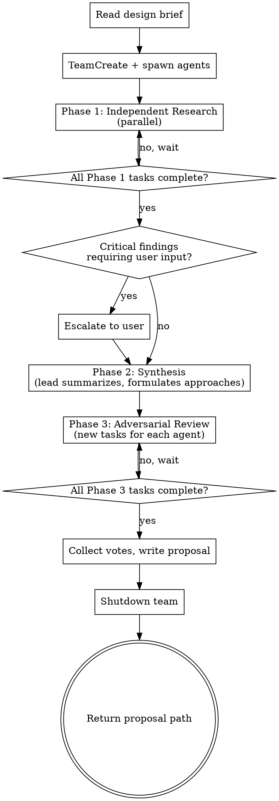

# Team Design

Orchestrate parallel specialist agents to produce a design proposal with multiple approaches, trade-offs, and a team recommendation.

**Input:** Path to a design brief (structured markdown, written by brainstorming skill).

**Output:** Path to a design proposal (structured markdown) containing 2-3 approaches with trade-offs, team recommendation with vote breakdown, and unresolved disagreements.

## Team Composition

Core roles (always present):
- **Architect** — system design, decomposition, interfaces, integration with existing codebase
- **Researcher** — documentation, best practices, alternative technologies, industry examples
- **Devil's advocate** — challenges assumptions, finds edge cases, failure modes, what's missing

Optional roles (proposed by brainstorming lead based on project scope, user approves):
- **Security reviewer** — threat modeling, attack surface, auth/authz implications
- **UX/DX specialist** — user flows, API ergonomics, developer experience

## Process Flow



## Phase 1: Independent Research

Each specialist investigates the design brief from their domain perspective, working in parallel.

**Startup:**

1. Read the design brief at the provided path
2. Determine which roles to use (core roles always; optional roles as approved by user)
3. Create a team via `TeamCreate`
4. Spawn each agent via the `Agent` tool with `subagent_type: "general-purpose"`, `team_name`, and `name` parameters. Agents need file read, web search, and Context7 access.
5. Create one `TaskCreate` task per agent — the task description includes:
   - The full design brief path (agent reads this file)
   - The role-specific research assignment (read from the corresponding role prompt file)
   - The output path: `docs/superpowers/proposals/YYYY-MM-DD-<topic>-<role>-report.md`
   - Instruction to write the report using the Report Format (below) and mark the task complete
6. Assign each task via `TaskUpdate` with `owner` set to the agent's name

**Role prompt files** (relative to this skill):

- `./architect-prompt.md`
- `./researcher-prompt.md`
- `./devils-advocate-prompt.md`
- `./security-reviewer-prompt.md`
- `./ux-specialist-prompt.md`

Role prompts contain domain-specific research instructions only — no team coordination mechanics. This file handles all orchestration.

**Research focus by role:**

| Role | Research Focus |
|------|---------------|
| Architect | Decomposition, interfaces, existing patterns in codebase, data flow |
| Researcher | Documentation, best practices, alternatives, examples, known pitfalls. Actively uses web search and Context7. |
| Devil's advocate | Hidden assumptions, edge cases, failure modes, what's missing. Studies issues/bugs in similar solutions. |
| Security (opt.) | Threat model, attack surface, auth/authz, data exposure |
| UX/DX (opt.) | User flows, API ergonomics, developer experience, error handling |

Each agent saves their report to `docs/superpowers/proposals/YYYY-MM-DD-<topic>-<role>-report.md`.

**Wait for all Phase 1 tasks to complete before proceeding.**

## Phase 2: Synthesis

The lead collects all reports and synthesizes them into a unified analysis. This is the lead's own work — no agent delegation.

1. **Summarize each report** into key points. Do NOT paste full report text into the synthesis — summarize findings to manage context. Full reports remain available at their file paths if you need to re-read specific sections.
2. **Identify agreements** — findings that multiple roles converge on
3. **Identify contradictions** — where roles disagree or raise conflicting concerns
4. **Formulate 2-3 approaches** that incorporate input from all specialists. For each approach, collect arguments for/against from each role's perspective.
5. **Write a synthesis document** — save to a working file the agents can read in Phase 3

**Escalation gate:** If any agent raised `critical` severity findings or open questions requiring user input, escalate to the user before proceeding to Phase 3. Present the critical findings clearly and wait for the user's response.

## Phase 3: Adversarial Review

Send the synthesis back to the team for evaluation. Each specialist reviews the proposed approaches from their domain perspective.

**You MUST create NEW tasks via `TaskCreate` for Phase 3.** Do not reuse Phase 1 tasks. Each new task description includes:
- The path to the synthesis document (so the agent can read it)
- The path to the agent's own Phase 1 report (so they can verify their findings were represented)
- Instructions to evaluate each approach, vote, and check for missed findings

Each specialist:
1. Evaluates each proposed approach on its merits from their perspective
2. Votes for a recommended approach with reasoning
3. Flags critical risks if any
4. As a separate step: checks whether any of their Phase 1 findings were missed or misrepresented in the synthesis

Assign each new task via `TaskUpdate` with `owner` set to the corresponding agent.

**Wait for all Phase 3 tasks to complete before proceeding.**

## Finalization

After collecting all Phase 3 assessments:

1. **Collect votes** and final assessments from all agents
2. **Write the design proposal** to `docs/superpowers/proposals/YYYY-MM-DD-<topic>-proposal.md` containing:
   - 2-3 approaches with trade-offs (enriched by all roles)
   - Team recommendation with vote breakdown
   - Unresolved disagreements (if any) with both sides' arguments
   - Open questions for the user
3. **Shutdown the team** — send `shutdown_request` via `SendMessage` to each agent, then `TeamDelete`
4. **Return the proposal path** to the brainstorming flow

## Failure Handling

**Agent stuck** (idle without completing task, or returns an error):
1. Send one follow-up message with clarification
2. If the agent fails again on the same task, exclude it from synthesis
3. Note in the proposal: "[Role] review incomplete — manual review recommended."

**>50% agents failed** (excluded from synthesis):
- Abort team-design entirely
- Fall back to solo brainstorming (lead produces the design alone)
- Notify the user that team mode failed and you're continuing solo

**Unresolvable disagreements** after one full Phase 2 → Phase 3 cycle:
- Include the disagreement in the design proposal with both sides' arguments
- The user resolves it — do NOT re-run phases to force consensus

## Report Format

All agents use this format for Phase 1 reports:

```markdown
## Research Report: [Role Name]

### Key Findings
- [critical|important|suggestion] Finding title: description + reasoning

### Proposed Approaches
For each approach the agent sees as viable:
- Approach name
- How it addresses the requirements
- Risks from this role's perspective

### Recommended Approach
- Which approach and why (from this role's perspective)

### Open Questions
- Questions that need user input
```

Severity levels:
- `critical` — blocks design, must be addressed before proceeding
- `important` — significantly affects design decisions
- `suggestion` — worth considering but not blocking

## Design Brief Format

The design brief is the contract between brainstorming and team-design. It must be self-contained — team agents have no access to the conversation history.

```markdown
# Design Brief: [Project Title]

## Project Description
What we're building and why. 1-3 paragraphs.

## Requirements
- Functional: what the system must do
- Non-functional: performance, security, scale constraints

## Decisions Already Made
Choices the user made during clarifying questions that are NOT open for debate.
E.g.: "Using PostgreSQL", "Must integrate with existing auth system"

## Open Questions
Areas where the team should explore alternatives and propose options.

## Codebase Context
- Key files and their roles (include relevant excerpts for critical files — agents can read full files but excerpts provide immediate context)
- Existing patterns and conventions
- Tech stack
- Relevant dependencies

## Constraints
- Timeline, budget, team size considerations
- Technical limitations
- Backward compatibility requirements

## Success Criteria
How we know the design is good enough.
```

The separation between `Decisions Already Made` and `Open Questions` is critical. Agents must not re-litigate closed decisions. Devil's advocate can challenge open questions but not closed ones. This saves tokens and focuses discussion.
